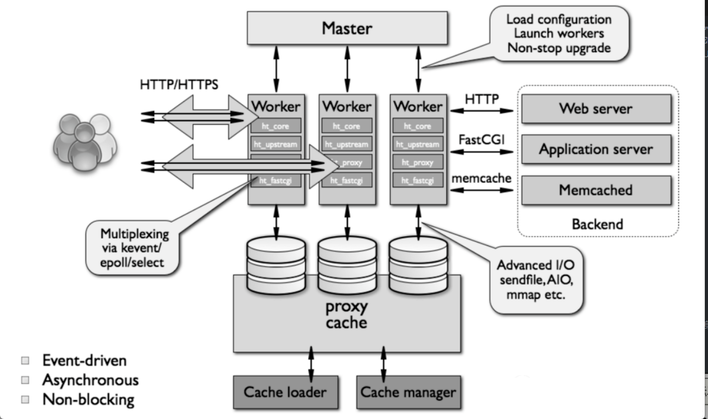
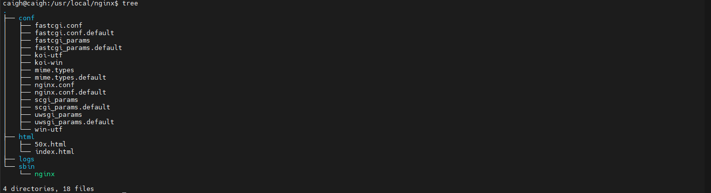
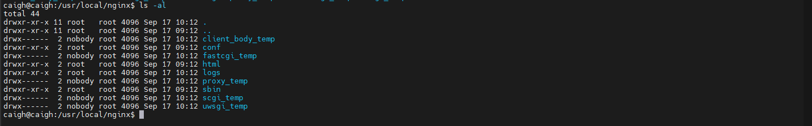
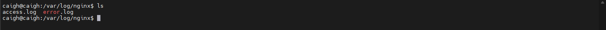
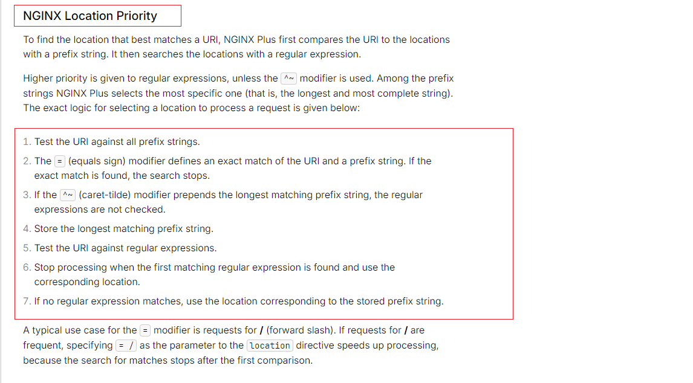

# Nginx基础入门

## 一、Nginx概述

### 1.1、Nginx介绍

Nginx 是一款轻量级的Web服务器、反向代理服务器，是由俄罗斯的程序设计师 Igor Sysoev 所开发，使用C语言开发，由于它的内存占用少，启动速度极快，具有高并发的能力，在互联网项目中被广泛地应用。 它的功能丰富，可作为 Http 服务器，静态资源服务器，也可作为反向代理服务器，邮件服务器等。支持 wFastCGI、SSL、Virtual Host、URL Rewrite、Gzip 等功能。

### 1.2、Nginx特点

1. 内存消耗低（异步非阻塞，多阶段处理）
2. 具有很高的可靠性（无数次的生产验证，很多头部公司都在用）
3. 热部署
4. 处理响应请求快（异步非阻塞I/O，零拷贝，mmap，缓存机制）
5. 扩展性好（模块化设计）
6. 高并发连接（事件驱动模型，多进程机制）
7. 自由的BSD许可协议（可以自己修改代码后发布，包容性极强）

### 1.3、nginx架构



从上边这张图，我们可以一览nginx的架构设计，首先我们可以直观得出 nginx 的几大特点：

多进程机制：另外可以得知 nginx 有两种类型的进程，一种是 Master 主进程，一种是 Worker 工作进程。主进程主要负责3项工作：`加载配置`、`启动工作进程` 及 `非停升级`。另外 work 进程是主进程启动后，fork 而来的。假设 Nginx fork 了多个(具体在于你的配置) Worker 进程，并且在 Master 进程中通过 socket 套接字监听（listen）80 端口。然后每个 worker 进程都可以去 accept 这个监听的 socket。 当一个连接进来后，所有 Worker 进程，都会收到消息，但是只有一个 Worker 进程可以 accept 这个连接，其它的则 accept 失败，Nginx 保证只有一个 Worker 去 accept 的方式就是 加锁（accept_mutex）。有了锁之后，在同一时刻，就只会有一个 Worker 进程去 accpet 连接，在 Worker 进程拿到 Http 请求后，就开始按照 worker 进程内的预置模块去处理该 Http 请求，最后返回响应结果并断开连接。其实如果熟悉 reactor 模型你会发现，nginx的设计有 reactor 的影子，只不过 reactor 的主 reactor 是会负责 accept 的，而 nginx 的主进程（对应主reactor） 是不会去 accept 的，而是交给了 worker 进程来处理。

worker 进程除了 accept 连接之外，还会执行：网络读写、存储读写、内容传输、以及请求分发等等。而其代码的模块化设计，也使得我们可以根据需要对功能模块 进行适当的选择和修改，编译成符合特定需要/业务的服务器

proxy cache：主要实现 nginx 服务器对客户端数据请求的快速响应。nginx 服务器在接收到被代理服务器的响应数据之后，一方面将数据传递给客户端，另一方面根据proxy cache的配置将这些数据缓存到本地硬盘上。当客户端再次访问相同的数据时，nginx服务器直接从硬盘检索到相应的数据返回给用户，从而减少与被代理服务器交互的时间。在缓存数据时，运用了零拷贝以及mmap技术，使得数据copy性能大幅提升。

反向代理：nginx 的强大之处其中一个就是他的反向代理，通过反向代理，可以隐藏真正的服务，增加其安全性，同时便于统一管理处理请求，另外可以很容易的做个负载均衡，更好的面对高并发的场景。

### 1.4、nginx模块

nginx 服务器由 n 多个模块组成，每个模块就是一个功能，某个模块只负责自身的功能。nginx 的模块是互相独立的，低耦合高内聚。

nginx模块示意图如下：


核心模块：是 nginx 服务器正常运行必不可少的模块，提供错误日志记录、配置文件解析、事件驱动机制、进程管理等核心功能

标准HTTP模块：提供 HTTP 协议解析相关的功能，如：端口配置、网页编码设置、HTTP 响应头设 置等

可选HTTP模块：主要用于扩展标准的 HTTP 功能，让nginx能处理一些特殊的服务，如：Flash 多 媒体传输、解析 GeoIP 请求、SSL 支持等

邮件服务模块：主要用于支持 nginx  的邮件服务，包括对 POP3 协议、IMAP 协议和 SMTP 协议的支持

### 1.5、nginx 常见应用场景

nginx 常用场景挺多的，比如：

+ 反向代理
+ 负载均衡
+ 缓存
+ 限流
+ 黑/白名单
+ 静态资源服务
+ 动静分离
+ 防盗链
+ 跨域
+ 高可用

## 二、Nginx安装

> 这里使用 Ubantu 22.04 TLS 版本进行安装 nginx

### 2.1、编译安装

编译安装的详细过程可以参考 [Linux系统的软件安装方式](/os/linux/linux-software-install/) 的源代码安装。虽然使用的 Linux 系统不一致，一个是 CentOS，一个是 Ubantu，但按照过程基本一致，差在安装命令不一样，详细可以问 AI 即可。

有差异的命令替换如下

```bash
sudo apt install gcc # 安装 gcc

sudo apt install libpcre3 libpcre3-dev -y # 安装 pcre pcre-devel

sudo apt install zlib1g zlib1g-dev # 安装 zlib zlib-devel 

sudo apt install make -y # 安装 make 命令，debian 没有 make 命令时需要手动安装
```

在这里使用编译安装，主要目录是编译安装的配置文件和目录清晰。

### 2.2、使用apt命令安装

```bash
sudo apt-get update

# 安装 nginx 命令
sudo apt-get install nginx # 在安装过程中，系统可能会提示你确认安装，输入 Y 并按回车继续。

# 验证安装
sudo systemctl status nginx
# 或
sudo nginx -v

# 启动、停止和重启 nginx
sudo systemctl start nginx # 启动 nginx
sudo systemctl stop nginx # 停止 nginx
sudo systemctl restart nginx # 重启 nginx
sudo systemctl reload nginx # 重新加载配置

# 设置开启重启
sudo systemctl enable nginx
```

## 三、Nginx目录

### 3.1、未启动时目录

在 nginx 安装完成之后进入 `/usr/local/nginx` 目录中，使用 tree 命令查看



从输出可以看到 nginx 分的很清晰，有配置（conf）目录、html目录、log目录、启动程序（sbin）目录。

当 nginx 启动时默认展示的默认页面在 `html/index.html`，错误默认页面为 `50x.html`

### 3.2、配置环境变量后的目录


安装完成之后，可以参考以下命令调用 nginx 命令

```bash
# 进入nginx/sbin目录
cd /usr/local/nginx/sbin
# 启动脚本
./nginx
# 停止
./nginx -s stop
# 重载
./nginx -s reload
# 杀掉nginx
./nginx -s quit
```

配置软连接，可以不需要通过 `/usr/local/nginx/sbin/nginx` 调用 nginx 命令

```bash
sudo ln -s /usr/local/nginx/sbin/nginx /usr/local/bin/nginx
```


nginx 命令详解

```bash
# 查看帮助 
nginx -help

# 查看版本
nginx -v

# 启动停止相关命令
nginx -s (stop、quit、reopen、reload) # send signal to a master process: stop, quit, reopen, reload

# 指定配置文件启动
nginx -c 文件路径 

# 查看运行的配置文件
nginx -T
```

当执行 `sudo nginx ` 启动命令之后，目录会多出几个，但是核心目录不变，可不必关心其他目录。



可以通过以下命令查看 nginx 进程

```bash
ps -ax | grep nginx
```

### 3.3、目录文件说明

#### 3.3.1、生效的配置文件路径

`/usr/local/nginx` 为 nginx 的主目录，默认生效的主配置文件为 `/usr/local/nginx/conf/nginx.conf`。但是不一定是 nginx.conf，而是取决于你启动 nginx 时候有没有指定 nginx.conf。

可以通过以下命令查看看当前生效的 nginx.conf 配置文件路径

```bash
sudo nginx -T
```


#### 3.3.2、日志目录

刚安装好的日志目录发现不再这个 `/usr/local/nginx/logs/` 目录下，而是放到了 `/var/log/nginx/ ` 这个目录下。

在 nginx 配置中，默认的日志文件路径通常取决于你的操作系统和 nginx 的安装方式。对于大多数 Linux 系统，默认的日志文件路径通常位于 `/var/log/nginx/` 目录下。

具体文件包括：`access.log`、`error.log`



也可以通过 nginx 的配置修改日志文件路径


下一个章节会提到 nginx.conf 配置文件

## 四、nginx.conf配置文件解读

首先我们要知道 `nginx.conf 文件是由一个一个的指令块组成的`，nginx 用 `{}` 标识一个指令块，指令块中再设置具体的指令（`注意：指令必须以 ; 号结尾`），指令块有 `全局块`，`events块`，`http块`，`server块` 和 `localtion块 以及 upstream块`。精简后的结构如下：

```nginx
全局模块
event模块
http模块
    upstream模块
    
    server模块
        localtion块
        localtion块
        ....
    server模块
        localtion块
        localtion块
        ...
    ....    
```

各模块的功能作用如下描述：

全局模块：配置影响 nginx 全局的指令，例如运行 nginx 的用户名，nginx 进程 pid 存放路径，日志存放路径，配置文件引入，worker 进程数等。

events块：配置影响 nginx 服务器或与用户的网络连接。比如每个进程的最大连接数，选取哪种事件驱动模型（select/poll epoll或者是其他等等nginx支持的）来处理连接请求，是否允许同时接受多个网路连接，开启多个网络连接序列化等。

http块：可以嵌套多个 server，配置代理，缓存，日志格式定义等绝大多数功能和第三方模块的配置。如文件引入，mime-type 定义，日志自定义，是否使用 sendfile 传输文件，连接超时时间，单连接请求数等。

server块：配置虚拟主机的相关参数比如域名端口等等，一个 http 中可以有多个 server。

location块：配置 url 路由规则

upstream块：配置上游服务器的地址以及负载均衡策略和重试策略等等

下列对默认 nginx.conf 的一些指令做出部分解释：

```bash
#user  nobody; # 指定Nginx Worker进程运行用户以及用户组，默认由 nobody 账号运行

worker_processes  1;  # 指定工作进程的个数，默认是1个。具体可以根据服务器cpu数量进行设置， 比如cpu有4个，可以设置为4。如果不知道cpu的数量，可以设置为auto。 nginx会自动判断服务器的cpu个数，并设置相应的进程数

#error_log  logs/error.log;  # 用来定义全局错误日志文件输出路径，这个设置也可以放入http块，server块，日志输出级别有debug、info、notice、warn、error、crit可供选择，其中，debug输出日志最为最详细，而crit输出日志最少。

#error_log  logs/error.log  notice;

#error_log  logs/error.log  info; # 指定error日志位置和日志级别

#pid        logs/nginx.pid;  # 用来指定进程pid的存储文件位置

events {
    accept_mutex on;   # 设置网路连接序列化，防止惊群现象发生，默认为on
    
    # Nginx支持的工作模式有select、poll、kqueue、epoll、rtsig和/dev/poll，其中select和poll都是标准的工作模式，kqueue和epoll是高效的工作模式，不同的是epoll用在Linux平台上，而kqueue用在BSD系统中，对于Linux系统，epoll工作模式是首选
    use epoll;
    
    # 用于定义Nginx每个工作进程的最大连接数，默认是1024。最大客户端连接数由worker_processes和worker_connections决定，即Max_client=worker_processes*worker_connections在作为反向代理时，max_clients变为：max_clients = worker_processes *worker_connections/4。进程的最大连接数受Linux系统进程的最大打开文件数限制，在执行操作系统命令“ulimit -n 65536”后worker_connections的设置才能生效
    worker_connections  1024; 
}

# 对HTTP服务器相关属性的配置如下
http {
    include       mime.types; # 引入文件类型映射文件 
    default_type  application/octet-stream; # 如果没有找到指定的文件类型映射 使用默认配置 
    # 设置日志打印格式
    #log_format  main  '$remote_addr - $remote_user [$time_local] "$request" '
    #                  '$status $body_bytes_sent "$http_referer" '
    #                  '"$http_user_agent" "$http_x_forwarded_for"';

    #access_log  logs/access.log  main; # 设置日志输出路径以及 日志级别
    
    sendfile        on; # 开启零拷贝 省去了内核到用户态的两次copy故在文件传输时性能会有很大提升
    
    #tcp_nopush     on; # 数据包会累计到一定大小之后才会发送，减小了额外开销，提高网络效率
    
    keepalive_timeout  65; # 设置nginx服务器与客户端会话的超时时间。超过这个时间之后服务器会关闭该连接，客户端再次发起请求，则需要再次进行三次握手。
    
    #gzip  on; # 开启压缩功能，减少文件传输大小，节省带宽。

    server {
        listen       80; #nginx服务器监听的端口
        server_name  localhost; #监听的地址 nginx服务器域名/ip 多个使用英文逗号分割
        #access_log  logs/host.access.log  main; # 设置日志输出路径以及 级别，会覆盖http指令块的access_log配置
        
        # localtion用于定义请求匹配规则。 以下是实际使用中常见的3中配置（即分为：首页，静态，动态三种）
       
        # 第一种：直接匹配网站根目录，通过域名访问网站首页比较频繁，使用这个会加速处理，一般这个规则配成网站首页，假设此时我们的网站首页文件就是： usr/local/nginx/html/index.html
        location = / {  
            root   html; # 静态资源文件的根目录 比如我的是 /usr/local/nginx/html/
            index  index.html index.htm; # 静态资源文件名称 比如：网站首页html文件
        }
        
        # 第二种：静态资源匹配（静态文件修改少访问频繁，可以直接放到nginx或者统一放到文件服务器，减少后端服务的压力），假设把静态文件我们这里放到了 usr/local/nginx/webroot/static/目录下
        location ^~ /static/ {
            alias /webroot/static/; # 访问 ip:80/static/xxx.jpg后，将会去获取/url/local/nginx/webroot/static/xxx.jpg 文件并响应
        }
        
        # 第二种的另外一种方式：拦截所有 后缀名是 gif,jpg,jpeg,png,css.js,ico 这些 类静态的的请求，让他们都去直接访问静态文件目录即可
        location ~* \.(gif|jpg|jpeg|png|css|js|ico)$ {
            root /webroot/static/;
        }
        
        # 第三种：用来拦截非首页、非静态资源的动态数据请求，并转发到后端应用服务器 
        location / {
            proxy_pass http://backend_server; # 请求转向 upstream是backend_server 指令块所定义的服务器列表
            deny 192.168.3.29; #拒绝的ip （黑名单）
            allow 192.168.5.10; #允许的ip（白名单）
        }
        
        # 定义错误返回的页面，凡是 http 状态码是 500 502 503 504 总之50开头的都会返回这个 根目录下html文件夹下的50x.html文件内容
        error_page   500 502 503 504  /50x.html;
        location = /50x.html {
            root   html;
        }
        
    }
    
    # 其余的server配置 ,如果有需要的话
    #server {
        ......
    #    location / {
               ....
    #    }
    #}
    
    # HTTPS server
    # HTTPS 服务器相关的配置
    #server {
    #    listen       443 ssl;
    #    server_name  localhost;

    #    ssl_certificate      cert.pem;
    #    ssl_certificate_key  cert.key;

    #    ssl_session_cache    shared:SSL:1m;
    #    ssl_session_timeout  5m;

    #    ssl_ciphers  HIGH:!aNULL:!MD5;
    #    ssl_prefer_server_ciphers  on;

    #    location / {
    #        root   html;
    #        index  index.html index.htm;
    #    }
    #}
}

```

以上就是nginx.conf文件的配置了，主要讲了一些指令的含义，当然实际的指令有很多，配置文件并没有全部写出来。详细可以见 [Nginx文](https://nginx.org/en/docs/)档

另外值的注意的是： 因为有些指令是可以在不同作用域使用的，如果在多个作用域都有相同指令的使用，那么 nginx 将会遵循就近原则或者我愿称之为 `内层配置优先`。 例如: 你在 http 配了日志级别，也在某个 server 中配了日志级别，那么这个 server 将使用他自己配置的已不使用外层的 http日志配置

## 五、location 路由匹配规则


> 当前部署 nginx 的服务器 ip 为 192.168.1.100

location配置语法：`location [修饰符] pattern {…}`

常见匹配规则如下：

| 修饰符 | 作用                                                         |
| ------ | ------------------------------------------------------------ |
| /      | 通用匹配，任何请求都会匹配到（只要你域名对，所有请求都可以） |
| 空     | 无修饰符的前缀匹配，匹配前缀是你配置的 url （例如：/aaa）    |
| =      | 精确匹配                                                     |
| ^~     | ^~类型的前缀匹配，类似于无修饰符前缀匹配，不同的是，如果匹配到了，那么就停止后续匹配 |
| ~      | 正则表达式模式匹配，区分大小写                               |
| ~*     | 正则表达式模式匹配，不区分大小写                             |

### 5.1、无修饰符的前缀匹配

首先我在 `/usr/local/nginx` 目录下创建 locatest 目录，并修改 nginx.conf 添加以下配置

```nginx
location /prefixmatch {
  alias  /usr/local/nginx/locatest/;
  index  prefix_match.html;
}
```

然后再通过 curl 命令访问，以下是访问示例

```bash
curl http://192.168.1.100/prefixmatch      # ✅ 301
curl http://192.168.1.100/prefixmatch?     # ✅ 301
curl http://192.168.1.100/PREFIXMATCH      # ❌ 404
curl http://192.168.1.100/prefixmatch/     # ✅ 200
curl http://192.168.1.100/prefixmatchmmm   # ❌ 404
curl http://192.168.1.100/prefixmatch/mmm  # ❌ 404
curl http://192.168.1.100/aaa/prefixmatch/ # ❌ 404
```

可以看到 `域名/prefixmatch` 和 `域名/prefixmatch?` 返回了301 ，原因在于 prefixmatch 映射的 /usr/local/nginx/locatest/ 是个目录，而不是个文件所以 nginx 提示我们301，这个我们不用管没关系，总之我们知道：`域名/prefixmatch`，`域名/prefixmatch?` 和`域名/prefixmatch/` 这三个url通过我们配置的 `无修饰符前缀匹配规则` 都能匹配上就行了。

这里需要注意的一个是 root 和 alias 的区别：

| 语法  | 说明                                                         |
| ----- | ------------------------------------------------------------ |
| root  | 指定静态资源目录位置，它可以写在 http、server、location配置中，`注意：root 会将定义路径与 URL 叠加`。 |
| alias | 它也是指定静态资源目录位置，它只能写在 `location` 中，`使用 alias 末尾一定要添加 `/` ，并且它只能位于 `location` 中` |

root 使用示例如下

```nginx
location /image {
  root /opt/nginx/static;
}
```

当用户访问 http://192.168.1.100/image/1.png 时，实际在服务器找的路径是 /opt/nginx/static/image/1.png。会拼接上 image 的路径，这是需要额外注意的。

alias 使用示例如下
```nginx
location /image {
  alias /opt/nginx/static/image/;
}
```

当用户访问 http://192.168.1.100/image/1.png 时，实际在服务器找的路径是 /opt/nginx/static/image/1.png。

### 5.2、精确匹配

修改 nginx.conf 添加以下配置

```nginx
location = /exactmatch {
    default_type text/plain;
    return 200 "exact match";
}
```

然后再通过 curl 命令访问，以下是访问示例

```bash
curl http://192.168.1.100/exactmatch     # ✅ 200
curl http://192.168.1.100/exactmatch？   # ✅ 200
curl http://192.168.1.100/exactmatch/    # ❌ 404
curl http://192.168.1.100/exactmatchmmmm # ❌ 404
curl http://192.168.1.100/EXACTMATCH     # ❌ 404
```

可以看出来精确匹配就是精确匹配，差一个字也不行

### 5.3、前缀匹配（ ^~ ）

修改 nginx.conf 添加以下配置

```nginx
location ^~ /exactiprefixmatch {
    default_type text/plain;
    return 200 "exact prefix match";
}
```

然后再通过 curl 命令访问，以下是访问示例

```bash
curl http://192.168.1.100/exactprefixmatch     # ✅ 200
curl http://192.168.1.100/exactprefixmatch/    # ✅ 200
curl http://192.168.1.100/exactprefixmatch?    # ✅ 200
curl http://192.168.1.100/exactprefixmatchmmm  # ✅ 200
curl http://192.168.1.100/exactprefixmatch/mmm # ✅ 200
curl http://192.168.1.100/aaa/exactprefixmatch # ❌ 404
curl http://192.168.1.100/EXACTPREFIXMATCH     # ❌ 404
```

可以看到带修饰符 `^~` 的前缀匹配 `域名/exactprefixmatchmmm` 和`域名/exactprefixmatch/mmm` 是可以匹配上的，而不带修饰符的前缀匹配（5.1章节）这两个类型的 url 是匹配不上的直接返回了 404 ，其他的和不带修饰符的前缀匹配似乎都差不多。

### 5.4、正则匹配（~ 区分大小写）

修改 nginx.conf 添加以下配置

```nginx
location ~ ^/regexmatch$ { # ^表示开头，$表示结尾
    default_type text/plain;
    return 200 "regex match case";
}
```

然后再通过 curl 命令访问，以下是访问示例

```bash
curl http://192.168.1.100/regexmatch     # ✅ 200
curl http://192.168.1.100/regexmatch/    # ❌ 404
curl http://192.168.1.100/regexmatch?    # ✅ 200
curl http://192.168.1.100/regexmatchmmm  # ❌ 404
curl http://192.168.1.100/regexmatch/mmm # ❌ 404
curl http://192.168.1.100/REGEXMATCH     # ❌ 404
curl http://192.168.1.100/aaa/regexmatch # ❌ 404
curl http://192.168.1.100/bbbregexmatch  # ❌ 404
```

可以看到 `~` 修饰符的正则是区分大小写的

### 5.5、正则匹配（~* 不区分大小写）

修改 nginx.conf 添加以下配置

```nginx
location ~* ^/regexmatch$ {
    default_type text/plain;
    return 200 "regex match case";
}
```

可以看到这次 curl http://192.168.1.100/REGEXMATCH 是可以匹配上的，说明 ~* 确实是不区分大小写的。

### 5.6、location 匹配优先级

上述过程中讲述了多种 location 匹配规则，那么如果存在多个 location 优先走那个？这就要提及到 location 的匹配优先级，官方上也有详细说明，更加详细说明参考官方文档：https://docs.nginx.com/nginx/admin-guide/web-server/web-server/



location匹配优先级的总结如下：

1. 优先走 `精确匹配`，精确匹配命中时，直接走对应的 location，停止之后的匹配动作。
2. `无修饰符类型的前缀匹配` 和 `^~ 类型的前缀匹配` 命中时，收集命中的匹配，对比出最长的那一条并存起来(最长指的是与请求url匹配度最高的那个 location)。
3. 如果 `步骤2` 中最长的那一条匹配 `是^~类型的前缀匹配`，直接走此条匹配对应的 location 并 `停止` 后续匹配动作；如果 ` 步骤2` 的 `最长的那一条匹配` 不是^~类型的前缀匹配（也就 `是无修饰符的前缀匹配`），则 `继续往下`匹配
4. 按 location 的声明顺序，执行正则匹配，当找到第一个命中的正则 location 时，停止后续匹配。
5. 都没匹配到，走通用匹配（ / ）（如果有配置的话），如果没配置通用匹配的话，上边也都没匹配上，到这里就是404了。

## 六、静态服务器

nginx 本身配置一个 Server 时就可以配置一个静态服务器

```nginx
server {
    listen       80;
    charset      utf-8;
    server_name  localhost;

    #access_log  logs/host.access.log  main;

    location / {
        root   html;
        index  index.html index.htm;
    }

    #error_page  404              /404.html;
    # redirect server error pages to the static page /50x.html
    #
    error_page   500 502 503 504  /50x.html;
    location = /50x.html {
        root   html;
    }
}
```

