# 容器化技术快速入门

## 一、容器化技术概述

### 1.1、容器化技术概述

容器化技术是一种操作系统级别的虚拟化方法，它允许将应用程序及其依赖项（如运行时环境、系统工具、库等）打包成一个独立的、可移植的单元，这个单元就是容器。容器在运行时与宿主机共享操作系统内核，但又能在用户空间实现进程、网络、文件系统等资源的隔离，使得应用程序可以在不同的环境中以一致的方式运行。

容器化技术特点：轻量级、环境一致性、快速部署、可移植性强。

### 1.2、容器化技术与传统虚拟机的区别

1. 资源隔离与共享

   传统虚拟机：在硬件层面通过虚拟化技术（如 VMware、Hyper-V 等使用的技术）模拟出完整的硬件环境，每个虚拟机都有自己独立的操作系统内核，资源隔离是基于硬件级别的模拟实现的，不同虚拟机之间的资源完全独立，对硬件资源的消耗较大。

   容器：如前面所述，容器是基于操作系统内核的特性实现资源隔离，多个容器共享宿主机的内核，只是在用户空间进行隔离，在资源利用上更加高效，能在一台宿主机上运行更多的容器实例，但同时也因为共享内核，如果内核出现问题可能会影响所有容器。

2. 启动速度与资源占用

   传统虚拟机：启动时需要加载完整的操作系统内核、初始化各种系统服务等，启动过程耗时较长，并且由于每个虚拟机都包含完整的操作系统及应用，占用的磁盘空间和内存资源较多。

   容器：直接利用宿主机的内核，启动时只需加载容器自身的应用和配置，启动速度极快，而且镜像体积小，资源占用少，更适合在资源有限的环境下大规模部署应用。

3. 可移植性

   传统虚拟机：由于依赖特定的虚拟化平台和硬件环境，将虚拟机从一个平台迁移到另一个平台可能会遇到兼容性问题，需要进行复杂的配置和转换工作。

   容器：基于容器镜像的标准化格式，只要目标平台支持容器运行时，就能轻松迁移和部署，可移植性非常好。

### 1.3、容器化技术工具

容器化技术工具有很多种，其中 Docker 是最主流的容器化技术，像其他的还有 Kubernetes、Podman 等。

## 二、Podman介绍

在容器化技术中，选择 Podman 而不选择 Docker 的原因有以下几点：

| 问题概述                           | 原因                                                         |
| ---------------------------------- | ------------------------------------------------------------ |
| Docker Daemon 问题严重             | Docker 依赖一个长期运行的单一进程（Docker Daemon）意味着单点故障、以root权限运行，潜在安全风险高、调试 Daemon 极为困难，进程一旦问题就安全瘫痪。相比之下，其他方案如 containerd 和 CRI-O 并不需要这样一个中心化的守护进程，速度更快，权限更低。 |
| Docker Desktop 收费问题            | Docker 在企业环境对 Docker Desktop 开始收费，                |
| Kubernetes 已放弃 Docker           | Kubernetes 并未放弃容器技术，而是放弃了 Docker 作为运行时。Kubernetes 主推的是支持 CRI 接口的原生容器运行时，如 containerd 和 CRI-O。 |
| Podman 已经优于 Docker（多数场景） | Podman 几乎能无缝替代 Docker，并且更优秀。像 无 Daemon 进程、可非 root 用户运行、Docker 命令完全兼容 |
| Docker 限制访问                    | Docker 限制国内拉取镜像                                      |

Podman 是一个开源容器、Pod 和容器镜像管理引擎。Podman 可以轻松查找、运行、构建和共享容器。

Podman 官方文档参考：https://docs.podman.io/en/latest/Tutorials.html

## 三、Podman的Root模式和无Root模式差异

Podman 的设计核心是 `无守护进程` 和 `无 root 优先`，这使得两种模式在安全性、工作原理和体验上存在根本区别。

| 特性     | Root 模式 (Rootful)                                          | 无 Root 模式 (Rootless)                            |
| -------- | ------------------------------------------------------------ | -------------------------------------------------- |
| 运行用户 | root 用户或拥有 sudo 权限的用户                              | 系统的普通非特权用户                               |
| 守护进程 | 无需长期运行的守护进程，但有一个可选的、短暂的 `podman.socket` 用于 API 服务 | 完全不需要守护进程，每个用户会话启动自己的临时进程 |
| 安全性   | 较高风险                                                     | 非常安全，容器进程以普通用户身份运行               |
| 端口绑定 | 可以绑定所有端口（包括特权端口 1-1024）                      | 默认只能绑定 1024及以上 的高位端口                 |

Podman 安装完成之后，任何普通用户无需任何额外配置即可立即使用无 root 模式。

使用 root 模式只需要在命令前加上 sudo

```bash
# 以 root 身份运行一个 nginx 容器并绑定 80 端口
sudo podman run -d --name nginx -p 80:80 docker.io/nginx

# 查看 root 存储的镜像
sudo podman images

# 查看 root 存储的容器
sudo podman ps -a
```

注意：Root 模式和无 Root 模式的容器、镜像、存储都是完全隔离的。`sudo podman images` 看不到普通用户 `podman images` 拉取的镜像，反之亦然。

## 四、Podman安装

这里我使用 Ubuntu 22.04 LTS 服务器进行按照 Podman，更多详细安装过程参考官网介绍：https://podman.io/docs/installation#installing-on-linux

### 4.1、Podman安装

执行以下命令对 Podman 进行安装

```bash
sudo apt-get update
sudo apt-get -y install podman
```

查看是否安装成功

```bash
podman --version
```

运行显示 podman 版本说明已经安装成功

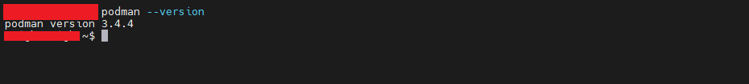

注意：Podman 默认无守护进程的模式运行。这与 Docker 不同，Docker 有一个常驻后台的 dockerd 服务。因此，Podman 本身并没有一个 “运行状态” 需要像系统服务那样去查看（如 active 或 inactive）

### 4.5、Podman配置文件修改 {#registries}

Podman 的配置文件位于 /etc/containers/registries.conf 和 /etc/containers/registries.conf.d/ 目录下的 `.conf` 文件。

/etc/containers/registries.conf 的优先级高于 /etc/containers/registries.conf.d/ 目录下的文件并且在该目录下按照字母顺序加载。

在 /etc/containers/registries.conf.d/ 目录下创建 00-mirror.conf 配置文件，配置内容如下

```tex
unqualified-search-registries = ["docker.1ms.run"]

[[registry]]
prefix = "docker.io"
location = "docker.io"

[[registry.mirror]]
location = "docker.1ms.run"
```

docker.1ms.run 是能够目前能找到的 docker.io 加速镜像地址，像一些其他加速镜像地址大部分已经关闭或共内部使用，这里先借助 docker.1ms.run 快速学习容器化技术。

后续如有容器私服地址可替换为私服地址

## 五、容器化核心概念

1. 镜像（images）：一个只读的模板，包含了运行应用程序所需的所有文件系统、库、依赖和代码。它是容器的蓝图
2. 容器（container）：镜像的一个可运行实例。容器运行时，会在镜像的只读层之上创建一个可写的容器层（Container Layer）。你可以创建、启动、停止、移动或删除容器。
3. 仓库（registry）：存储和分发镜像的地方，如 Docker Hub、[Quay.io](https://quay.io/) 等

## 六、容器生命周期

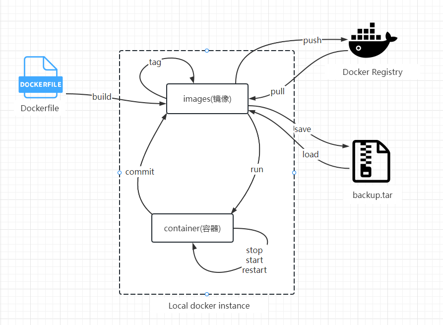

## 七、镜像

### 7.1、获取镜像

Podman 的镜像拉取默认是从 docker.io 远程镜像仓库进行拉取的，但是在 [Podman配置文件修改](./#registries) 章节中修改过 Podman 的配置文件，现在从 `docker.1ms.run ` 地址中拉取

```bash
# pull 命令是将远程仓库的镜像拉取到本地
podman pull nginx:latest # 在不更改配置的情况下相当于 podman pull docker.io/nginx:latest

# 或者直接指定远程镜像地址，临时方案居多
podman pull docker.1ms.run/nginx:latest
```

### 7.2、列出镜像

```bash
# 语法
podman images [options] [image]

# 列出本地存储中的镜像（排除非悬空映像）
podman images # 查看镜像一般使用这个即可不用加 -a 选项

# 显示列出的正在使用的图像与所有图像（包括悬空图像）
podman images -a 

# 列出与指定名称匹配的所有图像
podman images nginx

# 列出容器存储中所有镜像的镜像 ID
podman image ls --quiet

# 列出所有图像而不显示标题
podman images --noheading

# 以 JSON 格式列出所有图像
podman images --format json

# 列出按指定列排序的所有图像
podman images --sort repository
```

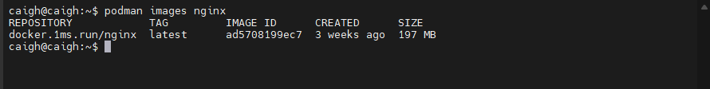

在列出信息中

| 字段       | 说明                      |
| ---------- | ------------------------- |
| REPOSITORY | 远程仓库地址和镜像名称    |
| TAG        | 镜像标记，如14.04、latest |
| IMAGE ID   | images ID （唯一）        |
| CREATED    | 创建时间                  |
| SIZE       | 镜像大小                  |

### 7.3、移除镜像

```bash
# 通过 镜像名:标签 删除
podman rmi nginx:alpine

# 通过 镜像ID 删除（更常用，因为ID是唯一的）
podman rmi <image_id>
```

当镜像正在被某个容器（无论是运行中还是已停止）使用时，直接删除会报错。这时需要 `-f` 选项

```bash
# 使用 -f 选项强制删除
podman rmi -f nginx:alpine
```

### 7.4、导入和导出镜像

Podman 的镜像导入和导出主要通过 `podman save` 和 `podman load` 两个命令完成。

导出主要将本地镜像备份到本地文件当中。

```bash
podman save -o my_nginx.tar <image_id> # 镜像id
```

注意：如果当前镜像存在容器正在运行当中会导出失败

载入镜像主要从导出的本地文件中再导入到本地镜像库

```bash
podman load -i my_nginx.tar 
```

### 7.5、构建镜像

Podman 构建镜像需要先创建 `Containerfile` 和 `Dockerfile` 文件，两者都是兼容

创建 Dockerfile 文件，内容如下

```tex
FROM docker.1ms.run/nginx
```

执行构建命令

```bash
podman build . -t my_build_nginx:latest
```

更多有关构建命令详情参考：https://www.osgeo.cn/podman/markdown/podman-build.1.html

## 八、容器

Podman 容器更多详细命令详解参考：https://docs.podman.io/en/latest/markdown/podman-container.1.html

### 8.1、启动容器

启动容器有两种方式，一种是 create 命令（不启动）和 start 命令运行，另一种是通过 run 命令运行

方式一： create 和 start 命令运行

```bash
# 基本语法
podman create [OPTIONS] <image_name> [COMMAND] [ARG...]
# --name：为容器指定一个易于记忆的名字，否则 Podman 会随机生成一个
#     -p: 将主机的端口映射到容器的端口
#    -it: -i 表示保持STDIN打开，-t 表示分配一个伪终端，通常用于交互式容器

# 示例：创建一个名为 “nginx” 的 Nginx 容器，并映射端口（主机端口:容器端口）
podman create --name nginx -p 8080:80 nginx

# 示例：创建一个交互式容器（但未启动），并准备一个伪终端
podman create -it --name my_ubuntu ubuntu:latest /bin/bash


# 通过容器名启动
podman start <container_name>

# 通过容器ID启动（可以只输入ID的前几位，只要能唯一识别即可）
podman start <container_id>

# 示例：启动之前创建的 nginx 容器
podman start nginx
```

方式二：run 命令运行，它是 `pull` + `create` + `start` 的集合。如果本地没有镜像，它会先拉取（`pull`），然后创建（`create`）并立即启动（`start`）容器

```bash
# 基本语法
podman run [OPTIONS] <image_name> [COMMAND] [ARG...]

# 示例：运行一个后台分离模式的 Nginx 容器（最常用）
podman run -d --name nginx -p 8080:80 nginx
```

```bash
# 示例：运行一个交互式的 Nginx 容器，并直接进入它的 Bash Shell
podman run -it --name nginx -p 8080:80 nginx /bin/bash
# 使用 exit 退出时，容器会停止运行
```

运行示例如下

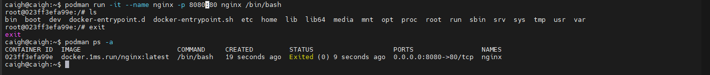

### 8.2、查看容器

```bash
# 查看正在运行的容器
podman ps

# 查看所有容器（包括已停止的）
podman ps -a

# 只显示容器的ID
podman ps -aq
```

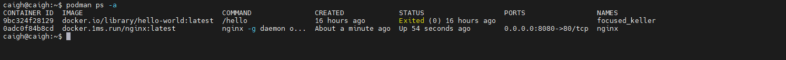

容器列表信息如下

| 字段         | 说明           |
| ------------ | -------------- |
| CONTAINER ID | 容器ID         |
| IMAGE        | 镜像           |
| CREATED      | 创建时间       |
| STATUS       | 容器状态       |
| PORTS        | 端口映射       |
| NAMES        | 指定的容器名称 |

### 8.3、进入容器

一般是指容器已经运行，需要进入到容器

```bash
podman exec -it <container_id> /bin/bash
```

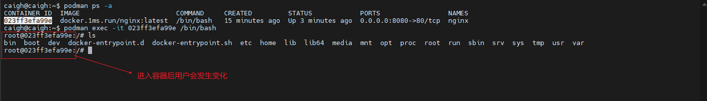

退出容器有两种：

1. 使用 exit 命令和 ctrl+d ：退出容器并会导致容器停止
2. 使用 ctrl+p+q：容器不停止退出容器

### 8.4、停止容器

停止一个或多个正在运行的容器

```bash
podman stop <container_name> or <container_id>

# 示例：停止 nginx  容器
podman stop nginx

# 可以同时停止多个容器
podman stop 容器1 容器2
```

强行停止/杀死容器，发送 SIGKILL 信号来强制立即终止一个容器（相当于 `kill -9`）

```bash
podman kill <container_name> or <container_id>
```

### 8.5、删除容器

删除已停止的容器。`容器必须处于停止状态才能被删除`，除非使用 `-f` 选项。

```bash
# 删除一个已停止的容器
podman rm <container_name> or <container_id>

# 强制删除一个容器（无论是否运行）
podman rm -f <container_name> or <container_id>

# 删除所有已停止的容器（非常有用！）
podman container prune

# 也可以结合 ps -aq 来批量删除
podman rm $(podman ps -aq)
```

## 九、仓库

### 9.1、默认远程仓库镜像

当使用 `podman login` 命令但没有指定任何服务器地址时，默认登录的是 [Docker Hub](https://hub.docker.com/)，也就是 docker.io。

```bash
podman login -u your_username # 等价于 podman login docker.io -u your_username
```

认证信息会被保存在 `$HOME/.docker/config.json` 文件中，用于后续向 `docker.io` 推送或拉取私有镜像。

如果需要登录其他第三方或自己私有的仓库，需要在命令中明确指定该仓库的地址

```bash
# 登录 Red Hat Quay.io
podman login quay.io -u your_quay_username

# 登录私有仓库，例如 Harbor
podman login registry.mycompany.com -u my_username
```

Podman 会为每个不同的仓库地址单独存储认证信息。你可以在 `$HOME/.docker/config.json` 或 `$HOME/.config/containers/auth.json`（取决于你的 Podman 版本和配置）中看到所有已登录的仓库地址及其对应的认证令牌（token）

### 9.2、私有仓库搭建

有时候使用 Docker Hub 这样的公共仓库可能不方便，用户可以创建一个本地仓库供私人使用，这里使用 [Harbor](https://goharbor.io/)。

由于安装 [Harbor](https://goharbor.io/) 需要依赖 docker 和 docker-compose，这里通过一台新服务器进行安装 docker 和 docker-compose。

安装 docker 过程参考 [Docker官网](https://docs.docker.com/engine/install/ubuntu/)

运行以下命令以卸载所有冲突的包

```bash
for pkg in docker.io docker-doc docker-compose docker-compose-v2 podman-docker containerd runc; do sudo apt-get remove $pkg; done
```

使用 apt 进行安装

```bash
# Add Docker's official GPG key:
sudo apt-get update
sudo apt-get install ca-certificates curl
sudo install -m 0755 -d /etc/apt/keyrings
sudo curl -fsSL https://download.docker.com/linux/ubuntu/gpg -o /etc/apt/keyrings/docker.asc
sudo chmod a+r /etc/apt/keyrings/docker.asc

# Add the repository to Apt sources:
echo \
  "deb [arch=$(dpkg --print-architecture) signed-by=/etc/apt/keyrings/docker.asc] https://download.docker.com/linux/ubuntu \
  $(. /etc/os-release && echo "${UBUNTU_CODENAME:-$VERSION_CODENAME}") stable" | \
  sudo tee /etc/apt/sources.list.d/docker.list > /dev/null
sudo apt-get update
```

安装 Docker 包

```bash
sudo apt-get install docker-ce docker-ce-cli containerd.io docker-buildx-plugin docker-compose-plugin
```

检查 docker 是否安装成功

```bash
docker --version
```

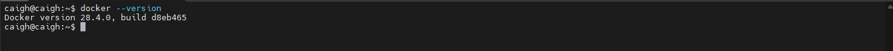

docker-compose 安装

```bash
sudo curl -SL https://github.com/docker/compose/releases/download/v2.39.2/docker-compose-linux-x86_64 -o /usr/local/bin/docker-compose

# 或将下载好的 docker-compose-linux-x86_64 文件上传到服务器
# 将文件移动到 /usr/local/bin 并重命名为 docker-compose
sudo mv docker-compose-linux-x86_64 /usr/local/bin/docker-compose
# 授予执行权限
sudo chmod +x /usr/local/bin/docker-compose

# 验证是否安装
docker-compose --version
```

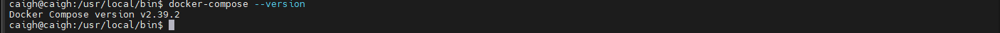

以上就是 Harbor 的准备工作准备完成。

前往 [Harbor releases page](https://github.com/goharbor/harbor/releases) 可以查看 Harbor 版本，这里采用 wget 进行离线安装

```bash
wget https://github.com/goharbor/harbor/releases/download/v2.13.2/harbor-offline-installer-v2.13.2.tgz
```

然后再进行解压操作

```bash
tar -xzvf harbor-offline-installer-v2.13.2.tgz
```

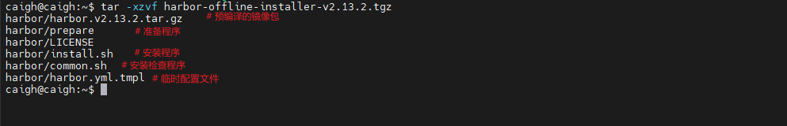

复制一份 harbor.yml.tmpl 文件内容，install.sh 执行的是 harbor.yml

```bash
cp harbor.yml.tmpl harbor.yml
```

修改 harbor.yml 配置

```bash
# 主机名（域名）或 IP，不能配置为 localhost 或 127.0.0.1，可以配置本地ip
hostname: reg.mydomain.com

# 如不想使用 https，可以将以下几行全部注释掉
https:
  port: 443
  # 指定之前已经提前准备好的证书和私钥，用于 nginx
  certificate: /usr/local/etc/ssl/certs/igeeksky.crt
  private_key: /usr/local/etc/ssl/private/igeeksky.key
  
# 管理员密码，可自行修改，账户为 admin
harbor_admin_password: Harbor12345

# harbor 数据库配置，密码默认为 root123，可自行修改
database:
  password: root123
```

然后在运行

```bash
sudo ./install.sh
```

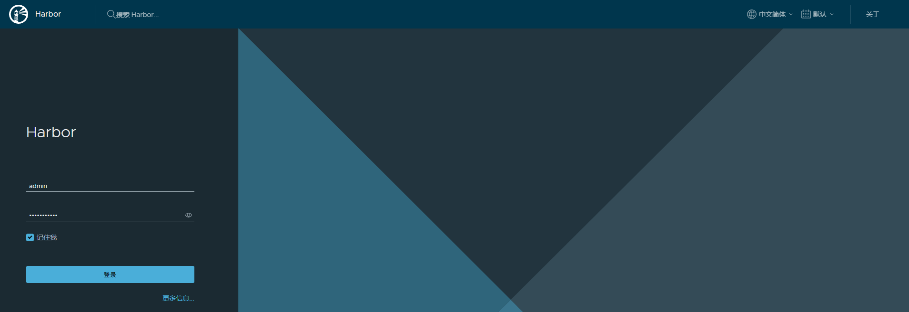

至此 docker 私服搭建成功

同时电脑关机之后，服务就会被关闭掉。在安装成功之后对应的 harbor 目录中会多出 docker-compose.yml 文件，该文件就是用来启动 Harbor 的

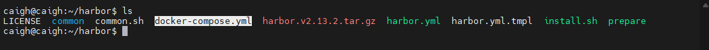

执行启动命令

```bash
sudo docker-compose up -d
```

### 9.3、将本地构建镜像发送私有仓库

需要在 Harbor 私服中创建一个项目，然后还有创建一个用户，因为 Harbor 私服默认一个管理员（admin）角色，该角色没有 push 镜像的权利。

创建用户，如下图所示

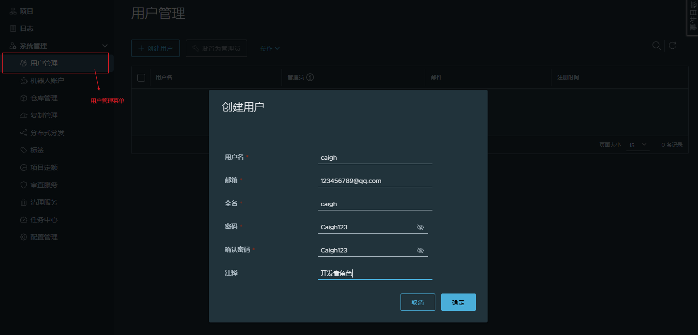

然后创建一个项目，如下图所示

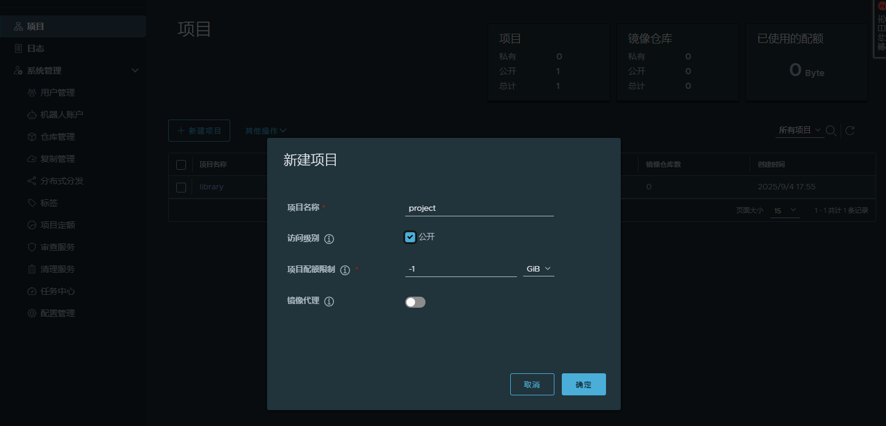

然后给当前项目传递一个用户并赋予开发者角色，如下图所示

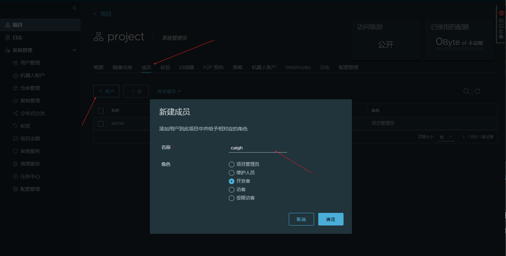

由于 Podman 默认要求对远程仓库是使用 https，而私服搭建是 http ，所以这需要先改动配置文件，修改内容如下

```tex
# 对于不安全的HTTP注册表（重要：这里只写IP和端口，不要带http://）
[registries.insecure]
registries = ['192.168.1.225:9527']
```

然后执行登录命令登录私服

```bash
podman login 192.168.1.225:9527 # 由于镜像名称不允许包含 http:// 或 https:// 协议头，这里不可以加 http:// 

# 如果需要退出登录
podman logout 192.168.1.225:9527

# 登录时会提示输入用户名和密码
# 这里输入的用户名和密码为 Harbor 创建的 caigh 用户
# 用户名：caigh
# 密码：Caigh123 
```

登录成功之后会提示 `Login Succeeded!`

镜像推送之前需要进行打 tag 处理，然后在执行 push 命令

```bash
podman tag <本地镜像ID> <仓库地址>/<项目名称>/<镜像名称>:<标签>

# 示例
podman tag ad5708199ec7 192.168.1.225:9527/project/my_nginx:1.0.0
```

```bash
podman push 192.168.1.225:9527/project/my_nginx:1.0.0
```

最后执行结果如下

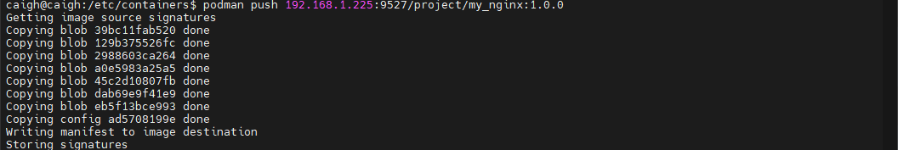

然后返回到 Harbor 仓库中查看

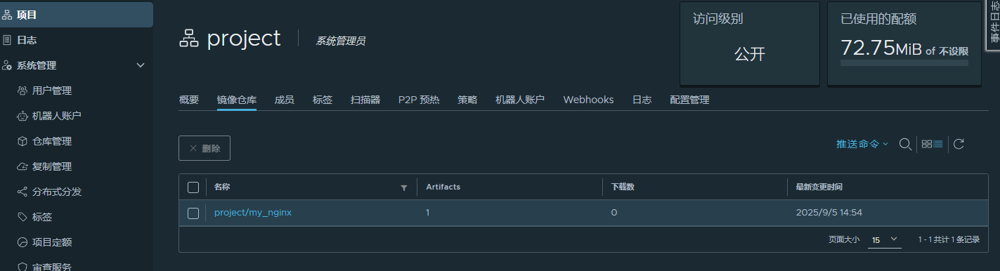

## 十、Podman数据卷映射

Podman 的数据卷映射（Volume Mount）是容器化中管理持久化数据的核心概念。它允许你将容器内的目录或文件与主机上的目录、文件或预先创建的数据卷进行关联，从而实现数据的持久化和共享。

Podman 数据卷映射主要有两种，一种是通过 create + run 的命令进行映射，另一种则是直接通过 run 命令进行映射

方式一：通过 create + run 的命令进行映射

```bash
# 创建卷
podman volume create my_app_data

# 列出所有创建的卷
podman volume ls

# 检查卷的详细信息
podman volume inspect my_app_data

# 清理所有未被任何容器引用的卷
podman volume prune

# 使用 run 命令进行容器卷映射
podman run -d --name nginx -v my_app_data:/volume -p 8080:80 nginx

# 其中 my_app_data 为 卷的名称
# /volume 为 容器内的目标路径
```

方式二：直接使用 run 进行数据卷映射

```bash
podman run -d --name nginx -v /data/volume:/volume:Z -p 8080:80 nginx
# 其中 /data/volume 为主机路径
# /volume 为 容器内的目标路径

# :Z 为挂载的内容提供一个私有的 SELinux 标签
# :z 为挂载的内容提供一个共享的 SELinux 标签
# :ro 以只读方式挂载，容器无法修改挂载点内的内容
# :rw 以读写方式挂载，默认情况下，卷以读写方式挂载
```

更多 podman run 命令选项配置可以参考：https://docs.podman.io/en/latest/markdown/podman-run.1.html

还有需要的提醒的是如果一个容器已经存在无法是否在运行中，都无法在进行数据卷映射。

```javascript
podman start -v /new/host/path:/new/container/path // [!code error]
```

## 十一、podman-compose

使用 Podman 可以运行容器，当我们需要运行多个容器时一个一个启动时费时费力更加不好后续维护。

podman-compose 主要用来管理和运行由 Podman 容器组成的多服务应用，并且和 docker-compose 高度相似，可以理解为 Docker Compose 的 Podman 实现。

### 11.1、podman-compose安装

```bash
# 先安装 pip 
sudo apt install pip

# 检查 pip 是否安装
pip --version

# 更新 pip
pip install --upgrade pip

# 安装 podman-compose
sudo pip3 install podman-compose
```

### 11.2、podman-compose使用

podman-compose 使用需要创建 podman-compose.yml 文件，该文件的书写语法与 docker-compose.yml 一样。更多详细书写语法和配置参考 https://docs.docker.com/reference/compose-file/

编写 podman-compose.yaml 示例如下

```bash
version: '3.8'

services:
  nginx: # 服务名称
    image: nginx:latest # 使用的镜像
    ports:
      - "8888:80" # 端口映射 (主机端口:容器端口)
```

 podman-compose 命令相关使用

```bash
# 进入包含 docker-compose.yml 文件的目录
cd /your/project/path


# 启动所有服务（并在后台运行）
podman-compose up -d

# 查看运行状态
podman-compose ps

# 查看日志
podman-compose logs

# 停止并移除所有容器、网络
podman-compose down

# 停止并移除所有容器、网络，同时删除数据卷（危险！）
podman-compose down -v
```


