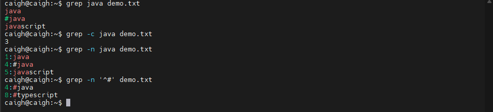

# Linux系统和命令

## 一、什么是操作系统

### 1.1、什么是操作系统

操作系统（Operating System，缩写为 OS）是一种软件，它负责管理和控制计算机的硬件和软件资源，同时作为用户与计算机硬件之间的接口。

操作系统通过协调和控制计算机程序的执行，提供了各种服务，如输入输出（I/O）、内存管理、处理器管理和文件管理等，使得用户能够便捷地使用计算机。

根据不同的应用场景，操作系统可以分为多种类型，包括桌面操作系统、手机操作系统、服务器操作系统和嵌入式操作系统等。操作系统被认为是计算机系统的核pa心组件，因为它充当了整个计算环境的中枢神经系统。

### 1.2、操作系统做的事情

1. 管理与配置内存
2. 决定系统资源供需的优先次序
3. 控制输入设备与输出设备
4. 操作网络与管理文件系统等基本事务
5. 操作系统也提供一个让用户与系统交互的操作界面


### 1.3、主流的操作系统


## 二、认识Linux

### 2.1、Linux的发展历程


### 2.2、什么是Linux?

Linux 是一套免费使用和自由传播的类Unix操作系统。是一个基于 POSIX 和 Unix 的多用户、多线程、多任务、支持多线程和多 CPU 的操作系统

它能运行主要的 Unix 工具软件，应用程序和网络协议，它支持 32 位和 64 位硬件。

Linux 继承了 Unix 以网络为核心的设计思想，是一个性能稳定的多用户网络操作系统。

### 2.3、Linux的基本思想


### 2.4、Linux的特点

1. 完全免费
2. 完全兼容 POSIX1.0 标准
3. 多用户，多任务
4. 良好的界面(部分版本有)
5. 支持多种平台
6. 代码开源

### 2.5、Linux的组成部分

Linux 一般由内核、Shell、文件结构和实用工具4个主要部分组成。内核是所有组成部分中最为基础、最重要的部分。

#### 2.5.1、内核

内核（Kernal）是整个操作系统的核心，管理着整个计算机的软硬件资源。内核控制整个计算机的运行，提供相应的硬件驱动程序、网络接口程序，并管理所有程序的执行。内核提供的都是操作系统最基本的功能。

Linux 内核源代码主要是用C语言编写的，Linux 内核采用比较模块化的结构，主要模块包括存储管理、进程管理、文件系统管理、设备管理和驱动、网络通信和系统调用等。

Linux 内核源代码通常安装在 /usr/src/linux 目录下，可供用户查看和修改。

#### 2.5.2、Linux Shell

Shell 是系统的用户界面，提供了用户与内核进行交互操作的一种接口。它接收用户输入的命令并把它送入内核去执行。实际上，Shell 是一个命令解释器，它解释由用户输入的命令并且把它们送到内核。Shell 还有自己的编程语言用于命令编辑，它允许用户编写由 Shell 命令组成的程序。Shell 编程语言具有普通编程语言的很多特点，比如它也有循环结构和分支控制结构等，用这种编程语言编写的 Shell 程序与其他应用程序具有同样的效果。

#### 2.5.3、Linux文件结构

文件结构是文件存放在磁盘等存储设备上的组织方法，主要体现在对文件和目录的组织上。目录提供了管理文件的一个方便而有效的途径。我们能够从一个目录切换到另一个目录，而且可以设置目录和文件的权限，设置文件的共享程度。

使用 Linux，用户可以设置目录和文件的权限，以便允许或拒绝其他人对其进行访问。Linux 目录采用多级树结构，用户可以浏览整个系统，可以进入任何一个已授权进入的目录，访问那里的文件。

#### 2.5.4、Linux实用工具

标准的 Linux 系统都有一套叫做实用工具的程序，它们是专门的程序，如编辑器、执行标准的计算操作等。用户也可以产生自己工具。实用工具可分为3类。

1. 编辑器：用于编辑文件。Linux 的编辑器主要有 Ed、Ex、Vi 和 Emacs。Ed 和 Ex 是行编辑器，Vi 和 Emacs 是全屏幕编辑器。
2. 过滤器：用于接收数据并过滤数据。Linux 的过滤器（Filter）读取用户文件或其他地方的输入，检查和处理数据，然后输出结束。
3. 交互程序：允许用户发送信息或接收来自其它用户的信息。交互程序是用户与机器的信息接口。

### 2.6、Linux发行商和常见发行版


## 三、安装Linux

详情参考 [VMware安装CentOS系统](/os/vmware/vmware-install-centos) 和 [VMware安装Ubuntu系统](/os/vmware/vmware-install-ubuntu/)

## 四、Linux文件类型和目录结构

### 4.1、Linux文件系统的结构

Linux 文件系统的结构层次鲜明，就像一颗倒立的树，最顶层是其根目录（root）


注意：根目录（root）与系统超级管理员 root 含义不一致，前者代表的是目录的根级，后者只是一个用户目录，管理员 root 文件夹在根目录（root）下

### 4.2、常见目录说明

| 目录名称    | 说明                                                         |
| ----------- | ------------------------------------------------------------ |
| /bin        | 存放二进制可执行文件(ls、cat、mkdir 等)，常用命令一般都在这里 |
| /etc        | 存放系统管理和配置文件                                       |
| /home       | 存放所有用户文件的根目录，是用户主目录的基点，比如用户 user 的主目录就是 /home/user，可以用 ~user 表示； |
| /usr        | 用于存放系统应用程序                                         |
| /opt        | 额外安装的可选应用程序所放置的位置。一般情况下，我们可以把tomcat等都安装到这里 |
| /proc       | 虚拟文件系统目录，是系统内存的映射。可直接访问这个目录来获取系统信息 |
| /root       | 超级用户（系统管理员）的主目录（特权阶级^o^）；              |
| /sbin       | 存放二进制可执行文件，只有 root 才能访问。这里存放的是系统管理员使用的系统级别的管理命令和程序。如 ifconfig等； |
| /dev        | 用于存放设备文件；                                           |
| /mnt        | 系统管理员安装临时文件系统的安装点，系统提供这个目录是让用户临时挂载其他的文件系统； |
| /boot       | 存放用于系统引导时使用的各种文件；                           |
| /lib        | 存放着系统运行相关的库文件；                                 |
| /tmp        | 用于存放各种临时文件，是公用的临时文件存储点；               |
| /var        | 用于存放运行时需要改变数据的文件，也是某些大文件的溢出区，比方说各种服务的日志文件（系统启动日志等） |
| /lost+found | 这个目录平时是空的，系统非正常关机而留下 “无家可归” 的文件（windows下叫什么.chk）就在这里。 |

## 五、Linux命令

### 5.1、目录切换命令

| 命令            | 含义                    |
| --------------- | ----------------------- |
| cd usr          | 切换到该目录下的usr目录 |
| cd ../ 或 cd .. | 切换到上一层目录        |
| cd /            | 切换到系统根目录        |
| cd ~            | 切换到用户主目录        |
| cd -            | 切换到上一个所在目录    |
| pwd             | 显示当前所在目录的路径  |

### 5.2、目录操作命令

#### 5.2.1、查看目录

```bash
ls [-a -l -al] [文件路径]

# 例如：
ls -a /home
```

#### 5.2.2、创建目录

```bash
mkdir 目录名称

# 例如：
mkdir test（在当前目录下）
```

#### 5.2.3、删除目录

```bash
rm [-rf] 目录
```

注意：rm 命令不仅可以删除目录，也可以删除其他文件或压缩包，为了增强记忆，无论删除任何目录或文件，都直接使用 `rm -rf ` 目录/文件/压缩包

#### 5.2.4、修改目录（重命名）

```bash
mv 目录名称 新目录名称

# 例如
mv test newTest
```

#### 5.2.5、拷贝目录

```bash
cp -r 目录名称 目录拷贝的目标位置  其中：-r 代表递归拷贝
```

注意：cp 命令不仅可以拷贝目录还可以拷贝文件，压缩包等，拷贝文件和压缩包时不用写 -r 递归

#### 5.2.6、移动目录（剪切）

```bash
mv 目录名称 目录的新位置
```

注意：mv 命令不仅可以对目录进行剪切操作，对文件和压缩包等都可执行剪切操作。另外 mv命令 与 cp命令 的结果不同，mv 命令好像文件 “搬家”，文件个数并未增加。而 cp命令 对文件进行复制，文件个数增加了

#### 5.2.7、寻找目录

```bash
find 目录 参数
```

命令示例说明

| 命令                                   | 用途说明                                              |
| -------------------------------------- | ----------------------------------------------------- |
| find .                                 | 列出当前目录及子目录所有文件和文件夹                  |
| find /home -name "*.txt"               | 在 /home 目录下查找以 .txt 结尾的文件名               |
| find /home -iname "*.txt"              | 在 /home 目录下查找以 .txt 结尾的文件名，并忽略大小写 |
| find . -name "\*.txt" -o -name "*.pdf" | 当前目录及子目录下查找所有以 .txt 和 .pdf 结尾的文件  |

### 5.3、文件操作命令

#### 5.3.1、创建文件

```bash
touch 文件名称

# 重命名文件名
mv 旧文件名 新文件名
```

#### 5.3.2、修改文件内容

```bash
vi 文件
# 或者
vim 文件

# 命令说明
# 步骤一：使用 vi 和 vim 表示打开文件
# 步骤二：如果需要编辑需要按 INSERT 键
# 步骤三：编辑完成之后，按 ESC 键，如何输入 :wq 或 :q! （输入 wq 代表写入内容并退出，即保存；输入q!代表强制退出不保存）
```

#### 5.3.3、查看文件内容命令

```bash
cat 文件名称
```

#### 5.3.4、删除文件

```bash
rm [-rf] 文件名称
```

这里的 -r 代表递归删除，删除文件时可以不加 -r，-f 表示强制删除

### 5.4、压缩文件的操作命令

Linux 的打包文件一般是以 `.tar` 结尾的，压缩的命令一般是以 `.gz` 结尾的。而一般情况下打包和压缩是一起进行的，打包并压缩后的文件的后缀名一般 `.tar.gz`

#### 5.4.1、压缩文件

```bash
tar -zcvf 打包压缩后的文件名 要打包压缩的文件
```

| 参数 | 参数含义                 |
| ---- | ------------------------ |
| -z   | 调用gzip压缩命令进行压缩 |
| -c   | 打包文件                 |
| -v   | 显示运行过程             |
| -f   | 指定文件名               |

#### 5.4.2、解压文件

```bash
tar [-xvf] 压缩文件
```

| 参数 | 参数含义     |
| ---- | ------------ |
| -x   | 代表解压     |
| -v   | 显示运行过程 |
| -f   | 指定文件名   |

### 5.5、用户以及用户组管理

Linux 系统中的每个用户都有以一个唯一的用户名和用户ID。组（group）是一组用户的集合，它们共享相同的权限，每个组都有一个组名和组ID（gid）。用户可以被分配到一个或多个组中

#### 5.5.1、查看用户信息

查看系统内的所有用户

```bash
cat /etc/passwd
# 或
getent passwd
```

/etc/passwd 目录保存了所有用户的配置信息（无敏感信息），这里将返回的结果摘取其中的一部分，一般来说这通常会包含很多用户（包括非自己创建的）

```tex
root:x:0:0:root:/root:/bin/bash
caigh:x:1000:1000:caigh:/home/caigh:/bin/bash
```

其中以 `:` 进行分割所代表的含义为 `用户名:密码占位符:用户ID:组ID:用户全名:家目录:登录Shell`

| 名称       | 含义                                                         |
| ---------- | ------------------------------------------------------------ |
| 用户名     | 用户账户的名称，用于登录系统                                 |
| 密码占位符 | 在现代系统中，这个字段通常包含一个 “x”，表示密码已被移到了 /etc/shadow 文件中加密存储，以增强安全性 |
| 用户ID     | 一个唯一的数字标识，用于识别用户。0 为 root 用户，普通用户ID通常从1000开始 |
| 组ID       | 用户基本组的ID，决定了用户所属的初始组，与 /etc/group 文件中的组信息相匹配 |
| 用户全名   | 用户的全名                                                   |
| 家目录     | 用户登录后的默认工作目录                                     |
| 登录Shell  | 用户登录后的默认使用的 Shell 类型，如 /bin/bash 。如果这一项被设置为非交互式 Shell（如 sbin/nologin）则用户无法登录系统 |

#### 5.5.2、查看用户组信息

```bash
cat /etc/group
# 或
getent group
```

这里将返回的结果摘取其中的一部分，一般来说这通常会包含很多用户组（包括非自己创建的）

```bash
root:x:0:
caigh:x:1000:
```

其中以 `:` 进行分割所代表的含义为 `组名:密码占位符:组ID:附属用户列表`

| 名称         | 含义                                                      |
| ------------ | --------------------------------------------------------- |
| 组名         | 用户组的名称，用户标识该组                                |
| 密码占位符   | 使用 “x” 表示，实际密码会存储在 /etc/gshadow 或类似文件中 |
| 组ID         | 一个唯一标识组                                            |
| 附属用户列表 | 属于该组的用户列表，用户名之间用逗号（，）分隔。          |

#### 5.5.3、用户的分类

在 Linux 下，用户被分为三类

| 用户                       | 含义说明                                                     |
| -------------------------- | ------------------------------------------------------------ |
| 超级用户（root，uid=0）    | 用户在系统上有完全权限：可以修改和删除任何文件；可以运行任何命令，通常使用/root作为主目录 |
| 系统用户（uid>1&&uid<999） | 普通用户是使用系统的真实用户人群。一般情况下，普通用户只在自己的主目录和系统范围内的临时目录里（如 /tmp 和 /var/tmp）创建文件。普通用户通常把 /bin/bash 作为登录 Shell 和 /home 的子目录作为主目录 |
| 普通用户（uid>1000）       | 系统用户不代表人，而代表系统的组成部分，是用于服务，进程运行使用的用户。系统用户通常没有登录 Shell，因为它们不代表实际登录的用户。系统用户的主目录很少在 /home 中，而通常在属于相关应用的系统目录中 |

#### 5.5.4、查询用户所属分组

```bash
id 用户名
# 或
groups 用户名
```

例如

```bash
id caigh
uid=1000(caigh) gid=1000(caigh) groups=1000(caigh),4(adm),24(cdrom),27(sudo),30(dip),46(plugdev),110(lxd)
```

返回示例结果如下


其中，groups 后续表示的是用户所属分组和 gid

#### 5.5.5、添加用户

```bash
# 该命令会引导你完成一系列的设置，包括设置密码
adduser 新用户名
# 或
# 不自动创建家目录和设置密码
useradd [-u,-d,-e,-g,-G] 用户名
```

| 选项 | 说明                                                |
| ---- | --------------------------------------------------- |
| -u   | 指定用户的 uid 号，要求该 uid 未被其他用户使用      |
| -m   | 创建用户的家目录                                    |
| -M   | 不创建用户的家目录                                  |
| -e   | 指定用户的账户失效时间，可使用 YYY-MM-DD 的日期格式 |
| -g   | 指定用户的基本组名 （或使用 gid）                   |
| -G   | 指定用户的附加租名（或使用 gid）                    |

使用示例如下

```bash
sudo useradd -m tsai
```

在 Linux 系统中，添加新用户时系统会默认创建同名的用户组。这是Linux用户管理的基本机制，确保用户权限隔离和资源归属清晰，如下图


#### 5.5.6、删除用户

删除用户及其家目录可以使用 `userdel` 命令，如果要保留家目录，可以添加`-r`选项

```bash
userdel -r 用户名
```

#### 5.5.7、修改用户密码

```bash
# 设置 用户名
passwd 用户名
# 清除用户密码
passwd -d 用户名
```

#### 5.5.8、切换用户

```bash
# 切换到 root 用户
su - 

# 切换到指定用户名
su - 用户名

# sudo 命令（是当前用户切换到root，然后以root身份执行命令，执行完成后，直接退回到当前用户）
sudo +后续命令

# 退出切换的当前用户
exit
```

#### 5.5.9、修改用户信息

```bash
usermod [选项] 用户名

# 例如：修改用户的用户组ID
usermod -g new_groupID username
```

#### 5.5.10、用户组管理

```bash
# 创建新组
addgroup 组名

# 将用户添加到组
addgroup 用户名 组名

# 从用户组中移除用户
deluser 用户名 组名

# 删除组
groupdel 组名

# 强制删除用户组（如果组中仍有用户）
groupdel -f 组名
```

### 5.6、文件权限命令

#### 5.6.1、文件权限说明

操作系统中每个文件都有特定的权限，所属用户和所属组。权限是操作系统用来限制资源访问的机制，在Linux中权限一般分为读(readable)、写(writable)和执行(excutable)，分为三组。分别对应文件的属主(owner)，属组(group)和其他用户(other)，通过这样的机制来限制那些用户、那些组可以对特定的文件进行什么样的操作。

```bash
ls -al  // 查看某个目录下的文件或目录权限
```

示例展示如下

```tex
drwxrwxr-x 2 caigh caigh 4096 Sep  1 13:44 a.txt
-rw-rw-r-- 1 caigh caigh    0 Sep  1 13:45 b.txt
```

对于其中的 `drwxrwxr-x` 和 `-rw-rw-r--` 说明如下图


文件类型解释如下

| 文件类型 | 说明     |
| -------- | -------- |
| d        | 代码目录 |
| -        | 代表文件 |
| l        | 代表链接 |

读写执行权限划分如下

| 权限名称 | 说明                                    |
| -------- | --------------------------------------- |
| r        | 代表权限可读，r 也可以用数字 4 表示     |
| w        | 代表权限是可写，w 也可以用数字 2 表示   |
| x        | 代表权限是可执行，x 也可以用数字 1 表示 |

r、w、x 对于文件和目录而言，读写执行代表不同的意义

| 所属 | 权限名称 | 可执行操作                |
| ---- | -------- | ------------------------- |
| 文件 | r        | 可以使用 cat 查看文件内容 |
| 文件 | w        | 可以修改文件的内容        |
| 文件 | x        | 可以将其运行为二进制文件  |
| 目录 | r        | 可以查看目录下的列表      |
| 目录 | w        | 可以创建和删除目录下文件  |
| 目录 | x        | 可以使用 cd 命令进入目录  |

#### 5.6.2、文件所有者和所属组修改

在Linux操作系统中，文件权限是用来控制不同用户对文件或目录的访问权限。每个文件都有一个所有者（属主 owner）和一个所属组（属组 group），以及其他的用户（others）

| 文件   | 说明                                                         |
| ------ | ------------------------------------------------------------ |
| 所有者 | 一般为文件的创建者，谁创建了该文件，就成为该文件的所有者，用 ls -l 命令可以看到文件的所有者 |
| 所属组 | 当某个用户创建了一个文件后，这个文件的所在组就是该用户所在的组 用 ls -l 命令可以看到文件的所有组 |
| 其他组 | 除开文件的所有者和所在组的用户外，系统的其它用户都是文件的其它组 |


```bash
# 修改文件的所有者
chown 用户名 文件名

# 修改文件所有者和所属组
chown 用户名:所属组 文件名

# 修改所属组
chgrp 组名 文件名

# 综合修改文件/目录的权限
# u 表示所有者
# g 表示所属组
# o 表示其他用户
chmod u=rwx,g=rw,o=r 文件名（或目录名）

# 其他 chmod 方式使用
chmod u+x 文件名 # 给所有者添加执行权限
chmod u-x 文件名 # 给所有者删除执行权限

# 数字表示法
# 读：4，写：2，执行：1，综合就是 4+2+1 = 7
chmod 755 文件名 # 相当于 u=rwx,g=rx,o=rx
chmod 777 文件名 # 相当于 u=rwx,g=rwx,o=rwx

# -R 选项
chmod -R 777 目录名 # -R 选项表示递归地更改指定目录及其所有子目录和文件的权限 
```

### 5.7、grep、sed、awk相关命令

Linux 正则表达式如下

| 符号   | 含义                         | 符号    | 含义                           |
| ------ | ---------------------------- | ------- | ------------------------------ |
| ^      | 标记开头（最左侧）           | $       | 标记结尾（最右侧）             |
| ^$     | 空行                         | \       | 转义特殊字符                   |
| .      | 匹配任意一个字符             | *       | 匹配前一个字符0次或多次        |
| .*     | 匹配任意长度字符             | < 或 >  | 定位单词的左侧和右侧           |
| [ ]    | 匹配[ ]内任意一个字符        | [^ ]    | 匹配[ ]内字符以外的任意字符    |
| ?      | 匹配前一个字符0次或1次       | +       | 匹配前一个字符1次或多次        |
| [ ]+   | 匹配[ ]内任意字符1次或者多次 | ( )     | 分组过滤，()里的内容是一个整体 |
| \|     | 或，用于同时过滤多个字符串   |         |                                |
| \{m\}  | 匹配前一个字符m次            | \{m,n\} | 匹配前一个字符至少m次，至多n次 |
| \{m,\} | 匹配前一个字符至少m次        | \{,n\}  | 匹配前一个字符至多n次          |

#### 5.7.1、文本搜索grep命令

grep 命令

```bash
# grep [options] pattern file

# -i 忽略字符大小写
# -n 显示匹配的行号
# -c 统计匹配的行数
# -o 仅显示匹配到的字符串
# -q 静默模式，不输出任何信息
# -e 实现多个选项间的逻辑or关系
# -w 匹配整个单词
# -E 使用ERE,相当于egrep
# -F 相当于fgrep，不支持正则表达式
```

示例如下

```bash
grep java demo.txt # 从 demo.txt 文件查找 java 文本字符
grep -c java demo.txt # 返回查找行数统计
grep -n java demo.txt # 显示行号
grep '^#' demo.txt # 查找以 # 开头的
```



#### 5.7.2、文本替换sed命令

sed 是一个非交互式的、面向字符流的编辑器。它一次处理一行内容，根据预设的脚本指令来编辑文本流，是 Shell 脚本中进行文本替换、删除、插入等操作的终极工具。

```bash
# 基本语法
sed [options] '脚本命令' 输入文件

# options 选项
# -e 指定要执行的脚本命令，可以多个使用
# -f 从指定文件中读取脚本命令
# -i 直接修改文件内容，通常配合备份使用，如 -i.bak
# -i.bak 修改文件内容并备份
# -n 禁止自动输出
# -r 使用扩展正则表达式（ERE），而不是默认的基本正则表达式（BRE）

# 或者配合管道符 |
cat 输入文件 | sed [options] '脚本命令'
```

地址 - 指定操作行

| 地址表达式 | 含义                     | 示例                                               |
| ---------- | ------------------------ | -------------------------------------------------- |
| n          | 第 n 行（n 为数字）      | sed '5d' file # 删除第5行                          |
| $          | 最后一行                 | sed '$d' file # 删除最后一行                       |
| m,n        | 从第 m 行到第 n 行       | sed '2,5d' file # 删除2到5行                       |
| m~n        | 从第 m 行开始，每隔 n 行 | sed '1~2d' file \# 删除所有奇数行                  |
| /regexp/   | 匹配正则表达式的行       | sed '/^#/d' file # 删除所有注释行（以#开头）       |
| m,n!       | 取反，不匹配 m,n 的行    | sed '2,5!d' file \# 删除**除了**2到5行之外的所有行 |

操作 - 要执行的动作

| 操作 | 名称               | 作用                                             |
| ---- | ------------------ | ------------------------------------------------ |
| s    | 替换（substitute） | 最常用的操作，格式为 `s/模式/替换/标志`          |
| d    | 删除（delete）     | 删除模式空间的内容，立即开始下一轮循环           |
| p    | 打印（print）      | 打印当前模式空间的内容。通常与 `-n` 选项一起使用 |
| a    | 追加（append）     | 在当前行后追加一行文本                           |
| i    | 插入（insert）     | 在当前行前插入一行文本                           |
| c    | 更改（change）     | 用新文本替换当前行                               |
| y    | 转换（transform）  | 字符一对一转换，类似 `tr` 命令                   |
| q    | 退出（quit）       | 立即退出 sed                                     |
| r    | 读取文件（read）   | 将文件内容读取并插入到匹配行之后                 |
| w    | 写入文件（write）  | 将匹配行写入到另一个文件中                       |

假设一个示例文件 test.txt，文件内容如下

```tex
Hello World
This is a test file.
Line number 3.
123 abc 456
The end.
```

打印文件内容信息

```bash
# 打印内容
sed -n '/test/p' test.txt

# 打印第2行到第4行
sed -n '2,4p' test.txt
```

替换文件内容信息

```bash
### 替换的格式为 `s/模式/替换/标志` ###
# 1. 将每行的第一个 "is" 替换为 "IS"
sed -i 's/is/IS/' test.txt

# 2. 全局替换，将所有 "is" 替换为 "IS"
sed -i 's/is/IS/g' test.txt

# 3. 删除所有数字（将数字替换为空）
sed -i 's/[0-9]//g' test.txt

# 4. 只打印发生了替换的行（常用于grep功能）
sed -n 's/is/IS/p' test.txt

# 5. 使用不同的分隔符（当模式或替换内容中包含 `/` 时非常有用）
sed -i 's|/usr/local|/opt|g' file # 将路径 /usr/local 替换为 /opt
sed -i 's#/docs#/var/www#g' file  # 同样可以，使用 # 作为分隔符

# 6. 使用分组反向引用（使用 `\(` 和 `\)` 分组，用 `\1`, `\2` 引用）
echo "foo bar baz" | sed 's/\(foo\) \(bar\) \(baz\)/\3 \2 \1/' # 输出：baz bar foo
```

插入文件内容性信息

```bash
# 在第1行前插入一行 "---INSERTED LINE---"
sed '1i ---INSERTED LINE---' test.txt 
# 上述命令执行后会显示执行后的文本内容，但是实际内容不会修改，如果需要修改则需要加上 -i 指令
sed -i '1i ---INSERTED LINE---' test.txt 

# 在最后一行追加一行 "---APPENDED LINE---"
sed '$a ---APPENDED LINE---' test.txt
# 同理需要实际修改文件加 -i
sed -i '$a ---APPENDED LINE---' test.txt

# 将包含 "123" 的行替换为 "---CHANGED LINE---"
sed -i '/123/c ---CHANGED LINE---' test.txt
```

删除文件内容信息

```bash
# 1. 删除第3行
sed -i '3d' test.txt

# 删除包含 "test" 的行
sed -i '/test/d' test.txt

# 4. 删除从包含 "This" 的行到包含 "123" 的行
sed -i '/This/,/123/d' test.txt
```

多重命令执行

```bash
# 方式一：使用 -e 选项
sed -e 's/is/IS/' -e 's/line/LINE/' test.txt

# 方式二：使用分号 ; 分隔（更常用）
sed -i 's/is/IS/; s/line/LINE/' test.txt

# 方式三：使用分行书写（脚本中使用）
sed -i '
s/is/IS/
s/line/LINE/
' test.txt
```

备份原文件并修改原文件

```bash
sed -i.bak 's/old/new/g' test.txt
```

#### 5.7.3、awk命令

 awk 不仅仅是一个命令，它是一门模式扫描和处理语言，它特别擅长处理结构化文本数据，如日志、CSV、表格数据

```bash
awk '模式 { 动作 }' 文件
# 或
cat 文件 | awk '模式 { 动作 }'
```

假设示例文件 data.txt，内容如下

```tex
Alice 25 Engineer 5000
Bob 30 Designer 4500
Charlie 35 Manager 7000
Diana 28 Developer 5500
```

基本打印

```bash
# 打印整个文件（等同于 cat）
awk '{print $0}' data.txt

# 打印第一列（姓名）
awk '{print $1}' data.txt

# 打印第一列和第四列（姓名和薪资）
awk '{print $1, $4}' data.txt

# 打印最后一列
awk '{print $NF}' data.txt

# 打印行号和整行内容
awk '{print NR, $0}' data.txt
```

模式匹配（过滤行）

```bash
# 打印包含 "Charlie" 的行
awk '/Charlie/' data.txt

# 打印第3行
awk 'NR==3' data.txt

# 打印行号大于2的行
awk 'NR>2' data.txt

# 打印薪资大于5000的员工
awk '$4 > 5000' data.txt

# 打印年龄小于30的员工姓名
awk '$2 < 30 {print $1}' data.txt

# 组合条件：年龄大于25且薪资小于6000
awk '$2>25 && $4<6000' data.txt

# 匹配正则表达式：名字以C开头的员工
awk '$1 ~ /^C/' data.txt

# 反向匹配：名字不以A开头的员工
awk '$1 !~ /^A/' data.txt
```

特殊的模式，分别在处理开始前和处理结束后执行一次。

```bash
awk 'BEGIN{print "Name\tAge\tJob\tSalary"; print "----------------------"}
     {print $1,"\t",$2,"\t",$3,"\t",$4}
     END{print "----------------------\nTotal records:", NR}' data.txt
```

指定分割符

```bash
# 处理 /etc/passwd（冒号分隔）
awk -F: '{print $1, $7}' /etc/passwd

# 在程序中指定分隔符
awk 'BEGIN{FS=":"}{print $1}' /etc/passwd
```

awk 命令远不止上述的功能，awk 使用频繁且功能强大，以上只是其中一部分功能解释和了解 awk 命令

#### 5.7.4、cut 命令

cut 命令用于从文件的每一行中提取指定的部分（字段、字符或字节），并将其输出到标准输出。它特别擅长处理结构化文本数据，如 CSV 文件、日志文件、系统配置文件等

```bash
cut [options] 文件

# 选项
# -f 按字段（列）提取（最常用）
# -d 指定字段分隔符（与 -f 配合使用）
# --complement 反选，提取未指定的部分
# -s 仅处理包含分隔符的行
```

假设示例文件 data.txt，内容如下

```tex
Alice:25:Engineer:5000:New York
Bob:30:Designer:4500:Boston
Charlie:35:Manager:7000:San Francisco
Diana:28:Developer:5500:Chicago
```

```bash
# 提取第一列（姓名）
cut -d: -f1 data.txt
# 输出：
# Alice
# Bob
# Charlie
# Diana

# 提取第一列和第三列（姓名和职位）
cut -d: -f1,3 data.txt
# 输出：
# Alice:Engineer
# Bob:Designer
# Charlie:Manager
# Diana:Developer

# 提取除了第一列之外的所有列
cut -d: -f1 --complement data.txt
# 输出：
# 25:Engineer:5000:New York
# 30:Designer:4500:Boston
# 35:Manager:7000:San Francisco
# 28:Developer:5500:Chicago

# 只处理包含冒号的行（跳过不含分隔符的行）
cut -d: -f1 -s data.txt
```

#### 5.7.5、管道

管道（ `|` ）是一个竖线符号，用于连接两个或多个命令，将前一个命令的标准输出作为后一个命令的标准输入

```bash
命令1 | 命令2 | 命令3 ... | 命令N
```

关键特性：

1. 单向流动：数据只能从左向右流动
2. 并行执行：所有命令几乎同时启动，形成一个流水线
3. 内存缓冲：数据通过内核的一小块内存缓冲区进行传递，而不是临时文件
4. 错误流分离：标准错误（stderr）**不会**通过管道传递，它仍然直接输出到终端

管道常用示例如下

```bash
# 查找并管理进程
ps aux | grep nginx          # 查找nginx进程
pkill -f "python script.py"  # 结束特定Python脚本

# 监控系统资源
top -bn1 | head -10          # 获取top快照的前10行
vmstat 1 5 | grep -v memory  # 查看系统状态，排除内存行

# 实时日志监控
tail -f /var/log/syslog | grep -i error # 实时监控错误日志

# 网络连接分析
netstat -tuln | grep :80        # 查看80端口占用
ss -tunap | grep nginx          # 查看nginx网络连接

# 安全扫描
cat /etc/passwd | awk -F: '$3==0 {print $1}' # 查找UID为0的用户（root）
```

### 5.8、进程命令

#### 5.8.1、进程查看命令

查看进程提供 ps、pstree、top 三个命令

```bash
# ps 命令
ps [options]

# [options]
# -A 显示所有进程
# -a 显示不与终端关联的所有进程
# -u 显示当前用户的进程
# -x 显示没有控制终端的进程
# -e 显示所有进程（等价于 -A）
# -f 显示完整格式（Full-format）的信息

# 常用命令
ps -ef # 显示所有进程，但格式更简洁
ps -aux # 查看所有进程的详细信息（用户、资源占用）

# 或也可以配置管道符（|）和 more 命令（用于分页显示文件内容。当你需要查看一个较大的文件时,使用more命令可以避免一次性加载整个文件,从而提高效率并减少系统资源的消耗）
ps -ef | more
```

```bash
# 需要先安装 sudo apt install psmisc
sudo apt install psmisc
# pstree 命令以树状展示进程
pstree
```

```bash
# top 命令
# 终端输入 top 即可
top
```

显示的部分指标含义解释如下图


#### 5.8.2、kill命令

kill 命令的本质是向一个或多个进程发送信号，默认情况下发送的是终止信号，但它的功能远不止 “杀死” 进程这么简单

显示系统信号

```bash
kill -l # 显示系统的所有信号
```


像平常用法

```bash
kill -9 pid pid pid # 杀死多个进程
```

### 5.9、内存和磁盘相关命令

```bash
# 查看磁盘
free [options]
# -h 以人类可读的单位（G, M）显示
# -m 以 MB 为单位显示
# -t 在最后显示一行总计
```

### 5.10、其他常用命令

防火墙相关命令

```bash
# 关闭防火墙
systemctl stop firewalld.service

# 禁止防火墙开机启动
systemctl disable firewalld.service

# 放行端口、允许访问80端口
firewall-cmd --zone=public --add-port=80/tcp --permanent

# 重启防火墙
firewall-cmd --reload
```

查看当前系统的网卡信息

```bash
ifconfig
```

查看网络是否连接外网成功

```bash
ping
```

查看当前系统的端口使用

```bash
netstat -an
```

关机

```bash
shutdown -h now  //指定现在立即关机
shutdown +5 "System will shutdown after 5 minutes"  //指定5分钟后关机
```

重新开机

```bash
reboot
```

