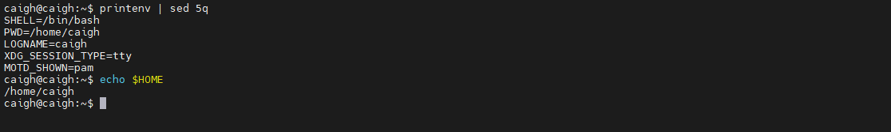
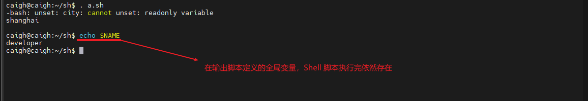
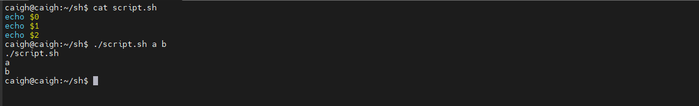
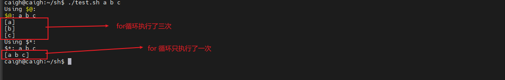
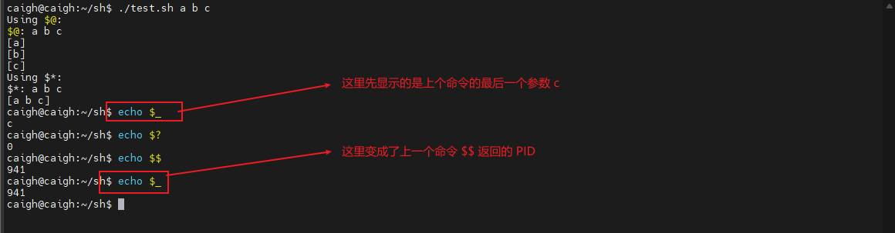

# Shell编程

## 一、Shell介绍

### 1.1、Shell概述

Shell 是一个命令解释器，它在操作系统的做外层，负责直接与用户对话，把用户的输入解释给操作系统，并处理各种各样的操作系统的输出结果，输出到屏幕返回给用户。这种对话方式可以是交互的方式（从键盘输入命令，可以立即的到shell的回应），或非交互（脚本）的方式。


### 1.2、Shell脚本概述

当 Linux 命令或语句不在命令行下执行（严格说，命令行也是 Shell），而是通过一个程序文件执行时，该程序就被称为 Shell脚本 或Shell程序，在 Window 中文件后缀名为 `*.bat`，Linux文件后缀名 `*.sh`。

### 1.3、Shebang

Shebang 是一种在 `Unix` 和 `Linux` 系统中使用的特殊注释，通常用于指定脚本文件的解释器。

Shebang 的语法非常简单。它只需要在文件的第一行添加一个井号 (#) 和一个惊叹号 (!)，紧接着是解释器的完整路径或可执行文件名，如下所示

```bash
# 示例
#!/bin/bash
```

这里的 `#!` 被称作 `Shebang`，用于告诉系统要使用哪个解释器来执行该脚本。

如果脚本未指定 Shebang，脚本执行的时候，默认用当前 Shell 去解释脚本，即 $SHELL。

### 1.4、查看系统安装的解析器

使用以下命令查看系统安装的解释器

```bash
cat /etc/shells
```

```tex
/bin/sh
/bin/bash
/usr/bin/bash
/bin/rbash
/usr/bin/rbash
/usr/bin/sh
/bin/dash
/usr/bin/dash
```

### 1.5、查看当前用户默认Shell

```bash
# 方法1：查看当前用户的默认shell
echo $SHELL

# 方法2：使用 grep 过滤 /etc/passwd 文件，信息更准确
grep "^$USER" /etc/passwd | cut -d: -f7

# 方法3：使用 getent 命令，效果同方法2
getent passwd $USER | cut -d: -f7
```

`$SHELL` 是环境变量，通常记录的是登录 Shell，但有时可能被脚本或 子Shell 改变。

查看 `/etc/passwd` 是最准确的方法，它直接反映了系统为该用户账户配置的默认值

## 二、Shell脚本书写规范

| 规范种类 | 说明                                                         |
| -------- | ------------------------------------------------------------ |
| 命名规范 | 变量名、函数名和文件名应使用小写字母，并用下划线（_）分隔单词，以提高可读性 |
| 注释     | 在 Shell 脚本中添加注释，有助于他人理解代码，注释应以 “#” 开头，并用空格隔开注释内容和 “#” |
| 变量     | 变量名应该尽量简短、具有描述性，且使用时需要加上 $ 符号，如 $VAR |
| 引号     | 在使用变量时，最好用双引号括起来，以防止变量中有空格等特殊字符 |

条件语句 `if-then-else` 语句的语法规范

```bash
if [ 条件 ]; then
    命令
elif [ 条件 ]; then
    命令
else
    命令
fi
```

循环语句 for 和 while 循环语句的语法规范

```bash
# for 循环
for 变量名 in 列表
do
    命令
done

# while 循环
while [ 条件 ]
do
    命令
done
```

函数应该使用 function 关键字定义，并且函数名和括号之间应该有一个空格

```bash
function 函数名 {
    命令
}
```

## 三、Shell脚本执行和调试

### 3.1、命令式执行

在命令行输入一个 Linux 命令得到对应的输出

```bash
ls -l # 以列表的形式输出当前目录的下文件目录
```

在命令行中，编写一条命令通过 `;` 进行分割，在书写一条命令，最终执行多条命令。

```bash
cd /home;ls -l
```

一般来说，多个命令或者复杂命令程序可以通过脚本来创建执行。

### 3.2、Shell脚本创建和执行

创建 Shell 脚本实际就是创建以 `.sh` 的文件

```bash
touch xxx.sh
chmod 777 xxx.sh # 给脚本添加执行权限

# 执行
sh -n xxx.sh
# options选项
# -c：执行完指定命令后退出
# -e：脚本执行过程中一旦发生错误就立即退出
# -t：检查语法错误
# -v：显示脚本执行过程中的详细信息
# -x：显示脚本执行的每个命令及其参数
```

### 3.3、Shell执行时父子进程

#### 3.3.1、Shell父子进程解释

当用户未登录时（如命令行或图形界面）输入密码登录时，系统仍然会启动一些 "非登录Shell"（non-login shell），或者更常见的是系统进程和服务会以该用户（要登录的用户）身份运行，但是使用的是一种非常受限的，没有完整用户环境的 "非交互式Shell"

用户登录 Linux 系统后，系统将启动一个用户 Shell，也就是上述说的 $SHELL 变量。在这个 Shell 中，可以使用 Shell 命令声明变量，也可以创建并运行 Shell 脚本，通过 `bash 或 sh` 命令运行 Shell 脚本程序时，系统将创建一个子 Shell。此时系统中将有两个 Shell，一个是登录时系统启动的 Shell，另一个是系统为运行脚本程序创建的 Shell。当一个脚本运行完毕，它的脚本 Shell 将终止，可以返回到执行该脚本之前的 Shell。从这种意义来说，用户可以有许多 Shell，每个 Shell 都是由某个 Shell (称为父Shell) 派生的。

在 子Shell 中定义的变量只在该 子Shell 内有效。如果在一个 Shell 脚本程序中定义了一个变量，当该脚本程序运行时，这个定义的变量只是该脚本程序内的一个局部变量，其他的 Shell 不能引用它，要使某个变量的值可以在其他 Shell 中被改变，可以使用 export 命令对已定义的变量进行输出。

export 命令将使系统在创建每一个新的 Shell 时定义这个变量的一个拷贝。这个过程称之为变量输出

#### 3.3.2、Shell的执行

在 Linux Shell 脚本中，是否开启子进程却决于你如何执行命令

| 命令           | 说明                                                         |
| -------------- | ------------------------------------------------------------ |
| 外部命令       | 几乎总是开启子进程                                           |
| Shell 内置命令 | 通常不开启子进程，例如：cd、echo、export                     |
| 执行方式       | source 或 . 不开启子进程，./xxx.sh 或 bash xxx.sh 会开启子进程以及 反引号（\`\`） 和 $() |

如何区分内置命令和外部命令

```bash
tyep cd # 返回 cd is a shell builtin 说明是内置命令否则不是
```

## 四、Shell变量

### 4.1、Shell变量分类

Shell 变量按作用域分为环境变量（全局变量）、局部变量

环境变量：使用 export 命令将局部变量提升为 "环境变量"，对当前 Shell 实例以及所有子进程都是可见的

局部变量：在脚本或函数内定义（不使用 export 命令下），只在定义它们的当前 Shell 实例中有效，对于函数内的变量，默认只在函数内部有效

```bash
# 输出所有环境变量
printenv

# 配合 sed 命令显示前面5行环境变量
 printenv | sed 5q
 
 # 如何调用环境变量
 echo $HOME
```



### 4.2、变量声明

定义一个脚本，定义局部变量如下

```bash
# 自定义局部变量，只支持字符串类型，不支持数字和布尔
name="jack"
age=18 # 实际还是字符串 "18" // [!code highlight]
# 当省去 "" 定义时不能有空格
desc=I am Jack # 错误  // [!code error]
desc=IamJack # 正确

# 定义只读变量，并且 unset 不可以删除
readonly city="shanghai"

export NAME=developer

unset city # 会提示 cannot unset: readonly variable，并且不会阻碍 Shell 的运行

echo $city

nickname="小明"

unset nickname

echo $nickname # 输出为空
```



如果需要使用 echo 输出多个变量时

```bash
name="jack"
age=18
desc=IamJack
echo "${name,age,desc}"
# 或者
echo "${name},${age},${desc}"
# 或者
echo "$name,$age,$desc"
```

还需要注意对变量的引用，示例如下

```bash
a=10
b=20
c=$a+$b # 当不加 "" 号时等同于 "$a+$b"，会输出 10+20，并不会输出30

# 如果需要输出 30
d=$(($a + $b)) # 在 $(( )) 中，变量会被当作数字
```

### 4.3、变量加载顺序

当前只说明登录 Shell 的加载顺序，在加载过程中会执行其中 sh 脚本，脚本中会设置其中的环境变量。

| 顺序 | 文件                | 说明                                                         |
| ---- | ------------------- | ------------------------------------------------------------ |
| 1    | /etc/profile        | **系统全局配置文件**。为所有用户设置环境。通常会调用其他目录下的脚本。 |
| 2    | /etc/profile.d/*.sh | `/etc/profile` 通常会遍历执行这个目录下的所有 `.sh` 脚本。这是安装软件时添加环境变量的推荐位置（例如 `java.sh`, `go.sh`） |
| 3    | ~/.bash_profile     | 用户个人配置文件（优先）。如果存在，则执行它并**停止**，不再执行后面的 `~/.bash_login` 和 `~/.profile` |
| 或   | ~/.bash_login       | 如果 `~/.bash_profile` 不存在，则尝试执行此文件              |
| 或   | ~/.profile          | 如果 `~/.bash_profile` 和 `~/.bash_login` 都不存在，则执行此文件。在 Debian/Ubuntu 上，这是图形界面登录的源文件 |

### 4.4、特殊变量和位置参数变量

#### 4.4.1、位置参数变量

位置参数用于访问传递给脚本或函数的参数，它们通过 `数字` 来引用。

| 变量    | 含义                                   | 示例 (调用脚本:  `./script.sh arg1 arg2 arg3`) |
| ------- | -------------------------------------- | ---------------------------------------------- |
| $0      | 脚本名称本身                           | echo $0 ==> `./script.sh`                      |
| $1      | 第一个参数                             | echo $1 ==> `arg1`                             |
| $2      | 第二个参数                             | echo $2 ==> `arg2`                             |
| $3      | 第三个参数                             | echo $3 ==> `arg3`                             |
| ...     | ... (以此类推，直到 `${N}` )           |                                                |
| $\{10\} | 第10个及以后的参数，必须用大括号括起来 | echo $3 ==> `arg10`                            |

示例如下图



#### 4.4.2、特殊变量

| 变量 | 含义与用途                                                   |
| ---- | ------------------------------------------------------------ |
| $#   | 参数个数。表示传递给脚本或函数的参数数量                     |
| $@   | 所有参数列表，每个参数都是一个独立的引用字符串（"$1" "$2" ...） |
| $*   | 所有参数合并为一个字符串。所有参数被连接成一个字符串，用第一个字符 of `$IFS`（内部字段分隔符，默认为空格）分隔。通常不如 `$@` 好用，容易出错。 |

`$@` 和 `$*` 区别

```bash
#!/bin/bash

echo "Using \$@:"
echo "\$@: $@"
for arg in "$@"; do # 保留所有参数的原始界限
    echo "[$arg]"
done

echo "Using \$*:"
echo "\$*: $*"
for arg in "$*"; do # 将所有参数合并成一个字符串
    echo "[$arg]"
done
```



`$*` 将所有参数合并成一个字符串，所有 for 循环只执行了一次

| 变量 | 含义与用途                                                   |
| ---- | ------------------------------------------------------------ |
| $?   | 上一个命令的退出状态码，这是最重要的特殊变量之一。0 表示成功，非 0 表示失败，不同的非零值通常代表不同的错误原因 |
| $$   | 当前 Shell 的进程ID（PID）                                   |
| $!   | 最后一个被放入后台运行的进程的 PID。用于之后控制该进程（如等待它结束或杀死它) |
| $_   | 上一个命令的最后一个参数，在交互式 Shell 中非常有用          |
| $IFS | 内部字段分隔符。决定了 Shell 如何对字符串进行分词。默认值是 `<space><tab><newline>`。修改它可以改变 `read`, `for` 循环等命令的行为 |

`$?` 、`$$` 、`$!` 示例如下



$IFS 示例

```bash
#!/bin/bash
data="one:two:three"

# 默认以空格分隔，所以整个字符串是一个词
for item in $data; do
    echo "[$item]"
done
# 输出: [one:two:three]

# 修改 IFS 为冒号 `:`
OLD_IFS=$IFS   # 备份原来的IFS
IFS=':'
for item in $data; do # 现在循环会对 $data 按冒号进行拆分
    echo "[$item]"
done
IFS=$OLD_IFS   # 恢复原来的IFS
# 输出:
# [one]
# [two]
# [three]
```

### 4.5、单引字符串和双引字符串、反字符串的区别

#### 4.5.1、单引号字符串

单引号表示创建一个纯字符串，引号内的所有字符都保持原样，没有任何特殊含义。

```bash
# $VAR 变量不会替换成变量的值、命令不会执行、反斜杠 \ 也被视为普通字符

# 示例
name="Alice"
# 单引号
echo 'Hello $name,\n today is `date`' # Hello $name,\n today is `date` # \n 不会被转移成换行符
```

#### 4.5.2、双引号字符串

双引号字符串内部 `$VAR` 会被替换成变量的值，转义字符会发生转义

```bash
name="Alice"

# 双引号
echo "Hello $name,\n today is `date`"
# 等价于，现代推荐写法：
echo "Hello $name,\n today is $(date)"
```

#### 4.5.3、反向字符串

这不是用来定义字符串的，而是用于【命令替换】（Command Substitution）。它的作用是先执行括号或反引号内的命令，然后用该命令的【标准输出】替换整个表达式。

```bash
# 将 date 命令的输出结果赋值给变量 today
today=$(date)
echo "Today is: $today"

# 反引号的旧式写法（不推荐）
today=`date`
echo "Today is: $today"
```

## 五、Shell集合类型

### 5.1、数组

数组定义和赋值，数组中的元素用括号包围，各元素之间用空格隔开。

```bash
# 数组定义和赋值
arr_data=(1 2 3 4)
# 可以重新设置指定元素的内容
arr_data[1]=65
echo ${arr_data[1]}

# 输出该数组中所有元素
echo ${arr_data[*]}
# or
echo ${arr_data[@]}

# 获取数组长度
echo ${#arr_data[*]}
```

### 5.2、Map

map 类型中存储的都是键值对

```bash
# 定义一个Map
declare -A m=(["a"]="1" ["b"]=2)

# 输出所有的Key
echo ${!m[@]}

# 输出所有的value
echo ${m[@]}

# 输出指定key对应的value
echo ${m["a"]}

# 添加元素
m["c"]=5
echo ${m["c"]}

# map中的键值对的个数
echo ${#m[@]}
```

## 六、Shell运算符

### 6.1、算术运算符

| 运算符 | 描述             | 举例（假设 `a=10`, `b=3` ） | 结果                     |
| ------ | ---------------- | --------------------------- | ------------------------ |
| +      | 加法             | echo $((a + b))             | 13                       |
| -      | 减法             | echo $((a - b))             | 7                        |
| *      | 乘法             | echo $((a * b))             | 30                       |
| /      | 除法（整数除法） | echo $((a / b))             | 3                        |
| %      | 取余             | echo $((a % b))             | 1                        |
| **     | 幂运算（指数）   | echo $((a ** b))            | 1000                     |
| ++     | 自增（前/后）    | echo $((a++))               | 10（先输出，后变为 11 ） |
| --     | 自减（前/后）    | echo $((--a))               | 9（先减为 9，后输出）    |
| =      | 赋值             | ((a = b))                   | `a` 的值变为 3           |

### 6.2、关系运算符

| 运算符 | 描述     | 示例（假设 `a=10`, `b=20`） | 结果 |
| ------ | -------- | --------------------------- | ---- |
| -eq    | 等于     | $((a == b)) 或 $((a eq b))  | 0    |
| -ne    | 不等于   | $((a != b)) 或 $((a ne b))  | 1    |
| -gt    | 大于     | $((a > b)) 或 $((a gt b))   | 0    |
| -lt    | 小于     | $((a < b)) 或 $((a lt b))   | 1    |
| -ge    | 大于等于 | $((a >= b)) 或 $((a ge b))  | 0    |
| -le    | 小于等于 | $((a <= b)) 或 $((a le b))  | 1    |

### 6.3、赋值运算符

| 运算符 | 示例       | 等价于    |
| ------ | ---------- | --------- |
| =      | a=10       | a=10      |
| +=     | ((a += 5)) | a = a + 5 |
| -=     | ((a -= 2)) | a = a - 2 |
| *=     | ((a *= 3)) | a = a * 3 |
| /=     | ((a /= 2)) | a = a / 2 |
| %=     | ((a %= 3)) | a = a % 3 |

### 6.4、布尔和逻辑运算符

| 运算符 | 描述         | 上下文                         | 示例                                                        |
| ------ | ------------ | ------------------------------ | ----------------------------------------------------------- |
| !      | 逻辑非 (NOT) | `$(( ))` 或 `[ ]`              | $((!0)) ==> 1，if [ ! -f file.txt ]; then                   |
| &&     | 逻辑与 (AND) | 命令之间，不可以在 `[]` 中使用 | `command1 && command2`，只有 command1 成功，才运行 command2 |
| \|\|   | 逻辑或 (OR)  | 命令之间，不可以在 `[]` 中使用 | `command1 || command2`，只有 command1 失败，才运行 command2 |
| -a     | 逻辑与 (AND) | 在 `[ ]` 命令内部              | if [ $a -gt 0 -a $a -lt 100 ]; then                         |
| -o     | 逻辑或 (OR)  | 在 `[ ]` 命令内部              | if [ $a -eq 0 -o $a -eq 100 ]; then                         |

### 6.5、字符串运算符

通常在 `[]` 或 `[[]]` 命令中使用

| 运算符  | 描述                   | 示例                                                        |
| ------- | ---------------------- | ----------------------------------------------------------- |
| = 或 == | 字符串相等             | if [ "$str1" = "$str2" ]; then                              |
| !=      | 字符串不相等           | if [ "$str1" != "$str2" ]; then                             |
| -z      | 字符串长度为零（空）   | if [ -z "$str" ]; then # 检查变量是否为空                   |
| -n      | 字符串长度非零（非空） | if [ -n "$str" ]; then                                      |
| <       | 按字典序小于           | if [[ "apple" < "banana" ]]; then  \# 必须在 `[[ ]]` 中使用 |
| >       | 按字典序大于           | if [[ "banana" > "apple" ]]; then \# 必须在 `[[ ]]` 中使用  |

### 6.6、文件测试运算符

用于测试文件的各种属性。是 Shell 脚本中最常用的运算符之一，同样在  `[ ]` 中使用

| 运算符          | 描述                                      | 示例                                                |
| --------------- | ----------------------------------------- | --------------------------------------------------- |
| -e              | 文件是否存在 (Exists)                     | if [ -e "/path/to/file" ]; then                     |
| -f              | 文件存在且为 `普通文件` (File)            | if [ -f "/path/to/file" ]; then                     |
| -d              | 文件存在且为 `目录` (Directory)           | if [ -d "/path/to/dir" ]; then                      |
| -s              | 文件存在且其大小 `大于零` (Size)          | if [ -s "/path/to/file" ]; then \# 检查文件是否非空 |
| -r              | 文件存在且 `可读` (Readable)              | if [ -r "/path/to/file" ]; then                     |
| -w              | 文件存在且 `可写` (Writable)              | if [ -w "/path/to/file" ]; then                     |
| -x              | 文件存在且 `可执行` (executable)          | if [ -x "/path/to/file" ]; then                     |
| -L              | 文件存在且为 `符号链接` (Link)            | if [ -L "/path/to/link" ]; then                     |
| -N              | 文件存在且自上次读取后 `被修改过`         | if [ -N "/path/to/file" ]; then                     |
| -O              | 文件存在且其 `所有者` 是当前用户          | if [ -O "/path/to/file" ]; then                     |
| -G              | 文件存在且其 `所属组` 是当前用户组        | if [ -G "/path/to/file" ]; then                     |
| file1 -nt file2 | 检查 file1 是否 `新于` file2 (Newer Than) | if [ "file1" -nt "file2" ]; then                    |
| file1 -ot file2 | 检查 file1 是否 `旧于` file2 (Older Than) | if [ "file1" -ot "file2" ]; then                    |

## 七、Shell控制语句

### 7.1、if语句

```bash
#!/bin/bash

# if语句
DATA=10

# 这里 $DATA 和 20 仍然是字符串运算符对比，而不是数字大小对比
if [ $DATA == 20 ]; then # 如果中括号不加分号，then则需要换行
  echo "相等"
else
  echo "不相等"
fi;
```

注意：使用 [] 加空格隔开

### 7.2、for循环语句

```bash
#!bin/bash

# for循环语句
arr=(1 5 8 78 4) 
# for item in $arr; 使用错误：单独使用$arr循环数组无法循环打印数组的值
for item in "${arr[@]}" # 正确方式
do
  echo $item
done

# 或者
for arg in 1 5 98
do
  echo $arg
done

# 或者
for ((i=1;i<=10;i=i+2))
do
  echo $i
done
```

### 7.3、while循环语句

```bash
#!bin/bash

# while循环语句
int=1
while(( $int<=5 ))
do
  echo $int
  let "int++"
done
```

### 7.4、until循环语句

```bash
#!bin/bash

# until循环语句
a=0
until [ ! $a -lt 5 ]
do
  echo $a
  a=`expr $a + 2`
done
```

### 7.5、break和continue语句

```bash
#!bin/bash

# break和continue语句
for num in 11 2 36 15 13 17
do
  # 如何 num 等于 2 就跳出循环
  if [ $num -eq 2 ]; then
  break
  fi
  echo $num
done

# continue
for VAR in 1 2 3
do
  #如果 VAR 等于 2，就跳过，直接进入下一次 VAR = 3 的循环 
  if [ $VAR -eq 2 ]; then
    continue    
  fi
  echo $VAR
done
```

## 八、Shell函数

### 8.1、函数创建和调用

```bash
#!bin/bash
# 函数定义和调用

# 格式一
function func1 () {
  echo "输出当前路径pwd:"
  pwd
}

# 格式二
function func2 {
  echo "输出当前目录下的ls:"
  ls
}

# 格式三
func3 () {
  echo "创建一个a.txt文件:"
  touch a.txt
}

# 注意：调用函数不需要括号
# 调用函数1
func1
# 调用函数2
func2
# 调用函数3
func3
```

### 8.2、函数入参和返参获取

```bash
#!bin/bash

# 函数入参和返参获取
function hello() {
  echo "输出获取的入参："
  # $1 代表获取第一个参数，$2 获取第二个参数，...以此类推
  echo $1 $2
  echo $* #输出 10 20 30
}

# 传递参数 10 20 
hello 10 20 30

# 定义一个含有返回值的函数
function getData() {
  echo $1 $2
  return 108
}

# 执行函数
getData

# 通过 $? 接收函数返回值
echo $? # 输出：108 

# 这里 $? 代表所有的命令的返回值仅表示其是否出错，而不会有其他有含义的结果
echo $? # 输出： 0
```

