# Linux系统的软件安装方式

## 一、Centos的rpm、yum软件包安装

### 1.1、rpm和yum简介

rpm Hat Package Manager）是一种软件包管理器，用于在基于 RedHat Linux 的操作系统中安装、卸载、更新软件包。它包含一个软件包文件格式、一组用于管理软件包的工具和一些包含在软件包中的元数据，RPM软件包通常以 .rpm 文件扩展名。

rpm 和 yum 的区别：

1. rpm 是一种软件包管理系统，它用于安装、升级、删除和查询已安装的软件包，而 yum 是一个基于 rpm 的包管理器，它可以自动解决软件包之间的依赖关系。

2. rpm 软件包通常包含预编译的二进制文件和支持文件，但不包含依赖的软件包，而 yum 软件包除了包含预编译的二进制文件和支持文件外，还包含了软件包之间的依赖关系，可以自动解决依赖关系。

3. rpm 可以从本地安装软件包，也可以从远程仓库安装，但需要手动解决依赖关系。而 yum 可以从远程仓库安装软件包，并自动解决软件包之间的依赖关系。

因为 rpm 需要手动解决依赖，依赖解决不了会导致无法安装成功，yum可以自动解决依赖关系，所以使用 yum 比 rpm 的使用概率比较大。

### 1.2、rpm软件包安装

首先要下载对应的 rpm 软件包，上传到服务器中

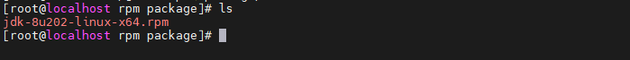

然后使用 rpm 命令进行安装

```bash
rpm -ivh jdk-8u202-linux-x64.rpm
```

其中，`-i` 代表安装，`-v` 代表详细输出，`-h` 代表显示安装进度。

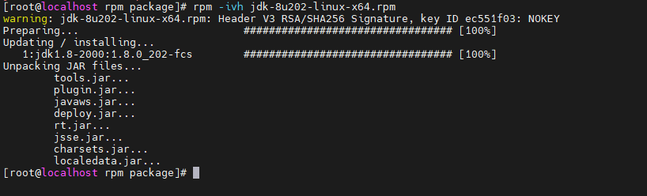

使用以下命令，查询是否安装成功

```bash
java -version
```

### 1.3、yum软件包安装

使用 yum 安装软件，以安装 net-tools 为例

```bash
yum install net-tools -y # -y 表示遇到依赖默认选择安装
```

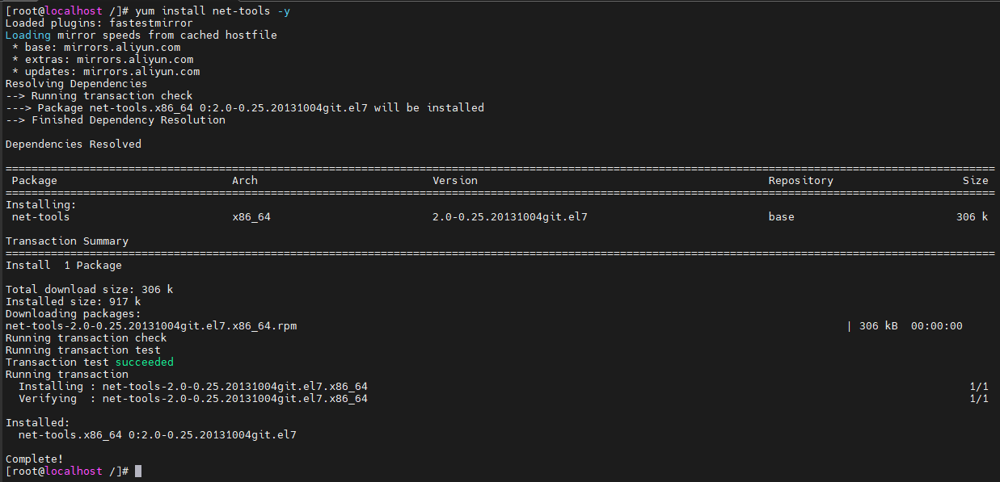

## 二、Ubuntu的apt-get软件包安装

随着 Linux 发行版的不断增多，各种不同的软件包管理系统也随之诞生。Debian 发行版是其中之一，debian、ubuntu 采用了一种名为 dpkg 的软件包管理系统。然而，dpkg 并没有提供自动解决软件包依赖关系的功能，这使得软件包的安装变得更加困难。通常需要安装的包都是以 .deb 为后缀名。

apt-get 是 apt 工具集中的一个组件，它是 apt 的前端命令行工具，用于从软件源中获取、安装、更新和卸载软件包。通过 apt-get，用户可以方便地管理系统上的软件包，同时它还支持自动解决软件包依赖关系，大大简化了软件包管理的流程。

Ubuntu 22.04 版本的最小安装默认带 dpkg 命令，如下图

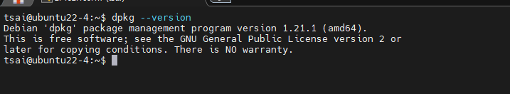

### 2.1、dpkg软件包安装

dpkg 的使用过程大致和 rpm 的使用一样，且目前使用大多是 apt-get 进行安装。

### 2.2、apt-get软件包安装

使用 apt-get 命令进行软件安装，以安装 git 为例

```bash
sudo apt-get install git
```

检查是否安装成功，如下图

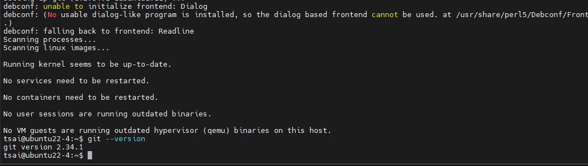

## 三、二进制安装

从 node 官网下载 nodejs 的二进制包，然后利用远程连接工具上传 nginx 压缩包，已安装 nodejs 为例

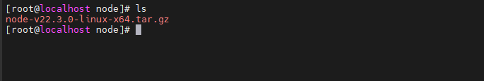

解压 tar.gz 文件

```bash
tar zxvf node-v22.3.0-linux-x64.tar.gz
```
将解压的 node 文件进行重命名，方便后续的操作

```bash
mv node-v22.3.0-linux-x64 nodejs
```
全局引用

```bash
ln -s /node/nodejs/bin/node /usr/local/bin # 引用 node
ln -s /node/nodejs/bin/node /usr/local/bin # 引用 npm
```
使用 node -v 命令查看，会报错

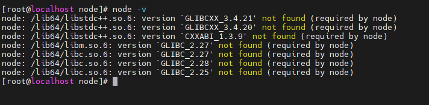

原因是：https://github.com/nodejs/issues 从 v18 开始，Nodejs 不再支持 centos7 和其他一些 Linux 发行版，因为 glibc 版本不兼容。

这里我改成 Ubuntu 22.04 版本安装 node22.3.0 版本，同样执行上述步骤过程，执行结果如下图

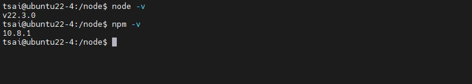

## 四、源代码安装

在 nginx 官网下载 nginx 源代码包，然后利用远程连接工具上传 nginx 压缩包，以安装 nginx 为例

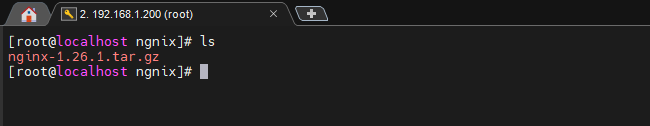

解压 tar.gz 文件

```bash
tar zxvf nginx-1.26.1.tar.gz
```
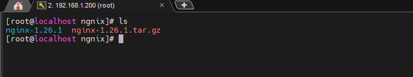

进入到 nginx-1.26.1 的文件夹中，找到 `configure 文件执行预编译脚本`

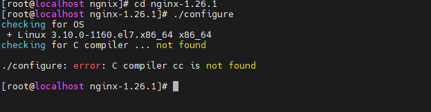

安装 nginx 执行环境

> 由于 nginx 是 C++ 编写执行的，可能在 liunx 中缺少相关C语言的相关执行环境

这里使用 yum 进行安装 gcc

```bash
yum install -y gcc
```
安装成功之后，再次执行 configure 文件并且指定安装路径

```bash
./configure --prefix=/usr/local/nginx # /usr/local/nginx 则是安装的路径
```

执行中间过程中报错，如下图

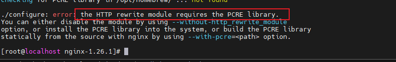

需要再安装 pcre 和 pcre-devel

```bash
yum install -y pcre pcre-devel
```

执行安装完成之后，再次执行 `./configure --prefix=/usr/local/nginx`，发现缺少 zlib 库

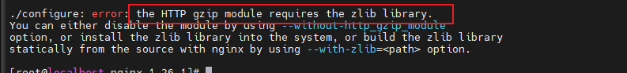

需要安装 zlib 和 zlib-devel

```bash
yum install -y zlib zlib-devel
```

安装完成之后再次执行 `./configure --prefix=/usr/local/nginx`，出现下列图示，说明执行编译完成

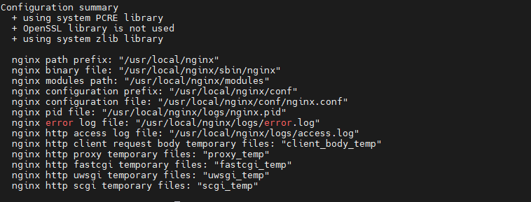

接下来执行

```bash
make
```

```bash
make install
```

执行完成之后，进入 `/usr/local/nginx` 路径查看

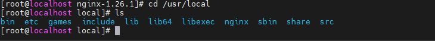

然后启动 nginx 以及关闭系统防火墙

```bash
cd /usr/local/nginx/sbin
./nginx  #执行启动ngnix
systemctl stop tirewalld.service # 关闭防火墙
```

然后对 nginx 进行访问

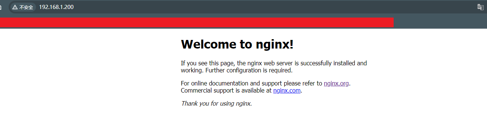

以上 nginx 源代码安装成功

## 五、wget和curl

### 5.1、wget用法

wget 不是安装方式，它是一种下载软件、如果要下载一个软件我们可以直接 `wget 下载地址`

首先，检查是否安装了 wget

```bash
wget --version
```

如果安装完则会显示 wget 的版本，如果未安装可以通过以下命令进行安装

```bash
// 基于RedHat
yum install wget -y

// 基于Debian/Ubuntu
sudo apt-get install wget
```

wget 常见的命令使用，options 表示选项，url 为下载连接地址，如下

```bash
wget [options] [url]
```

使用 -O 选项以其他名称保存下载的文件，如

```bash
wget -O node-v22.3.0 https://nodejs.org/dist/v22.3.0/node-v22.3.0-linux-x64.tar.gz
```

### 5.2、curl用法

curl 是一个利用 url 在命令行工作的文件传输工具，并不是所有的 Linux 系统中都会自带 curl 命令，例如简洁版的 Linux 系统就可能并不存在，先要进行安装。

```bash
yum install curl -y # 基于 Red Hat

sudo apt-get install curl # 基于Debian
```

使用 curl 下载并保存到本地文件

```bash
curl -o node22.3.0.tar.gz https://nodejs.org/dist/v22.3.0/node-v22.3.0.tar.gz
```

使用 `-o` 参数可以将下载的文件保存到本地，其中 `-o` 参数后指定要保存的文件名。

`curl` 是一个强大的命令行工具，用于在命令行或者脚本中与服务器交互。它支持多种协议，能够通过 URL 等参数发送请求，并获取或发送数据。适合用于测试 API、自动化任务、数据检索等场景。

发送 POST 请求

```bash
# 发送 POST 请求，加入 -d 参数后，会自动转为 POST 方法，因此可以省略 -X POST 参数
curl -X POST www.baidu.com -d 'a=1&b=2'
# 或者直接使用 curl www.baidu.com -d 'a=1&b=2'
```

发送 GET 请求

```bash
# 发送 GET 请求，-G 参数用来构造 URL 的查询字符串
curl https://google.com/search  -G -d 'q=kitties&count=20'
# 或者直接使用完整的 URL
curl 'https://google.com/search?q=kitties&count=20'
```

发送 JSON 请求

```bash
curl -H 'Content-Type: application/json' -X POST url -d '{
  "begin_date" : "20210328",
  "end_date" : "20210328"
}'
```
