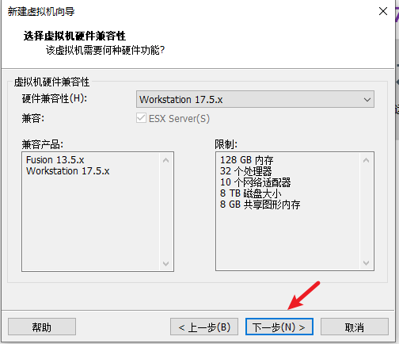

# VMware安装Ubuntu系统

## 一、环境准备阶段

> 以安装 Linux 系统为 Ubuntu22.04 版本为例

1. 准备 Ubantu22.04 的 ios 镜像文件
2. 安装 VMware Workstation 软件

## 二、安装步骤

1、运行 VMware Workstation，选择创建虚拟机


2、弹出虚拟机导向提示，选择 `自定义`


3、使用默认，点击下一步



4、选择稍后安装操作系统


5、选择安装操作系统


6、自定义命名虚拟机名称，后续选择硬件根据自己个人配置选择完可以直接下一步


7、配置虚拟机网络连接模式


8、使用默认，直接下一步


9、创建磁盘


10、自定义硬件配置


11、选择ISO镜像文件，选择之后直接点击完成即可


## 三、开机启动并设置安装ubuntu

1、默认选中 `Try or Install Ubuntu Server` 安装选项，回车


2、选择语言默认选择 `English`


3、镜像是否需要更新后才继续安装


4、设置键盘语言，选择默认


5、选择系统最小化安装


6、配置网络，这里之前选择了桥接，选择 IPv4 并且选择动态分配IP即可


7、设置系统代理，一般不需要配置，默认即可


8、设置包的源地址


可替换为国内的开源镜像源地址：

阿里云源 Mirror address 为：https://mirrors.aliyun.com/ubuntu

腾讯云源 Mirror address 为：https://mirrors.cloud.tencent.com/ubuntu

华为云源 Mirror address 为：https://repo.huaweicloud.com/ubuntu

清华大学源 Mirror address 为：https://mirrors.tuna.tsinghua.edu.cn/ubuntu

9、硬盘分区，这里选择默认


继续保持默认，选中 Done 并回车确认，弹出操作确认框，选中 Continue 并回车确认


10、配置用户名、登录密码等，根据个人情况填写，然后选中 Done 并回车确认


11、勾选 Install OpenSSH server 安装 OpenSSH 服务包，以启用对服务器的安全远程访问，然后选中 Done 并回车确认


11、一些精选的流行服务软件包，可根据个人情况进行选择安装，这里不勾选任何的软件包，直接选中 Done 并回车确认


12、配置完成，正式开始安装系统


13、安装完成后，选中 Reboot Now 并回车以重启系统


在安装过程遇到：`[FAILED] Failed unmounting /cdrom` 错误，且提示“Please remove the installation medium, then press ENTER: Unmounting /cdrom”，则按下 ENTER 回车键让它继续重启

## 四、测试网络和安装软件包

最小化安装使用 ping 命令会提示 ping：command not found，需要安装 iputils-ping 包，这里通过 apt-get 进行安装

```bash
sudo apt-get install iputils-ping
```

安装成功后，使用以下命令测试 ping 命令

```bash
ping www.baidu.com
```

安装 net-tools 工具，使用 ifconfig 命令查看本地ip

```bash
sudo apt-get install net-tools
```

安装 vim 工具

```bash
sudo apt-get install vim
```

## 五、设置静态ip

```bash
cd /etc/netplan
```
该目录下会存在 00-installer-config.yaml 文件，由于系统不同版本可能导致文件名称可能不一致。这里先将原始文件复制一份，防止设置错误可以及时回复原来的设置。

```bash
sudo cp 00-installer-config.yaml 00-installer-config-before.yaml
```

对 00-installer-config.yaml 进行修改，修改内容如下，修改好之后保存退出即可


最后执行以下命令即可

```bash
sudo netplan apply
```
